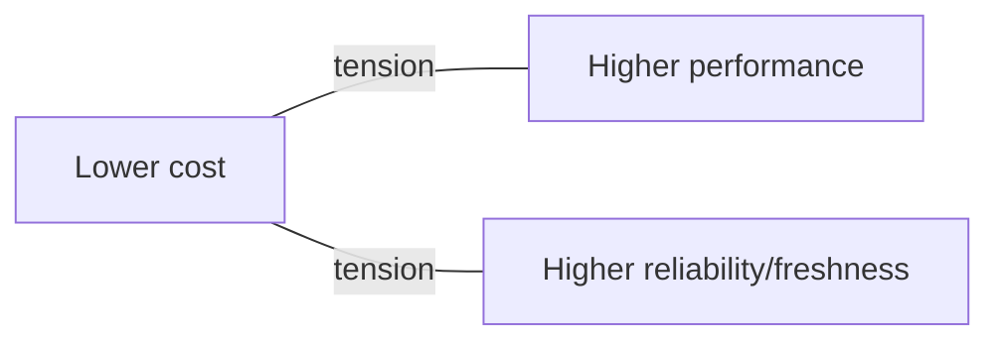

# Cost Fundamentals (FinOps)

## Why a data engineer must care about cost

In the cloud, **you rent by the second**. Every cluster you leave running, every terabyte you scan, every full-table rebuild shows up on a bill someone has to justify. Unlike on-prem (where the hardware was already bought), cloud makes **each engineering choice visible as money** — which means cost optimization *is* part of your job, not finance's.

Analogy: on-prem was **owning a car** — big upfront cost, then drive as much as you like. Cloud is a **taxi meter** — cheap to start, but it ticks every second you sit in traffic (idle clusters) or take the scenic route (scanning data you didn't need). A good data engineer drives efficiently and turns the meter off when parked.

---

## How cloud data costs are structured

| Cost category | Metered by | Typical share |
|---|---|---|
| **Compute** | Time × size of clusters / DWUs / RUs | **Usually the largest** |
| **Storage** | GB stored × storage tier | Small-to-moderate |
| **Data movement** | Egress (out of region/cloud), cross-region reads | Situational, can surprise |
| **Managed service fees** | Per-service (ADF activity runs, etc.) | Usually minor |

The headline: **compute dominates**, and compute cost = **how big × how long**. Two levers flow from that — use **smaller/right-sized** compute, and make jobs **finish faster** (which also improves performance).

---

## The universal cost levers

1. **Right-size compute** — don't run a 20-node cluster for a 2 GB job.
2. **Turn it off** — auto-terminate idle clusters; the #1 waste is compute running with nobody using it.
3. **Scan less data** — partition pruning, column pruning, file skipping; the less data touched, the less compute and time ([storage cost](03_Storage_and_Query_Cost.md)).
4. **Don't recompute needlessly** — incremental processing over full rebuilds; cache/reuse intermediate results.
5. **Pick the right compute type** — spot/serverless/job clusters where appropriate ([Databricks cost](02_Databricks_Cost_Optimization.md)).
6. **Keep data and compute co-located** — cross-region data movement adds egress cost and latency.

Almost every specific tip in this module is an instance of one of these six.

---

## Visibility — you can't optimize what you can't see

FinOps starts with **knowing where the money goes**:

- **Azure Cost Management** — cost analysis by resource, resource group, tag, and time; spot the expensive thing.
- **Tagging** — tag resources by project/team/environment so cost is attributable ("whose pipeline is this?").
- **Budgets & alerts** — set a budget per resource group and get alerted at 50/80/100% *before* the month-end surprise.
- **Per-service cost views** — Databricks usage dashboards, Synapse/Cosmos metrics.

A simple habit — check Cost Management weekly and tag everything — catches most runaway spend early.

---

## Governance — guardrails, not just cleanup

Mature teams **prevent** waste, not just find it after:

- **Cluster policies** (Databricks) that cap size, force auto-termination, and require tags.
- **Budgets with alerts** per environment.
- **Quotas/limits** so a runaway job can't scale to 100 nodes.
- **Auto-termination defaults** on every interactive cluster.
- **Environment separation** so dev experiments don't run on prod-sized compute ([DataOps](../15_Testing_and_DataOps/04_DataOps_and_CICD_for_Data.md)).

---

## The cost/performance/reliability trade-off

You can't blindly minimize cost — it trades against speed and reliability:

- Cutting a cluster too small → jobs slow or fail (missing [freshness SLAs](../13_Monitoring_and_Observability/03_Pipeline_Reliability.md)).
- Chasing max speed → oversized always-on compute.
- Aggressive spot instances → cheaper but can be reclaimed mid-job.

The skill is finding the **right point for each workload**: cheap-and-slow for a nightly non-urgent job, fast-and-costlier for a business-critical morning load. "It depends on the SLA" is the senior answer.

---

## Interview-grade Q&A

- *Why is cost a data engineer's responsibility?* Cloud meters every choice as money — cluster size, data scanned, idle time — so engineering decisions directly drive the bill.
- *What usually dominates a data platform's cost?* Compute (size × time); the top levers are right-sizing and finishing faster/scanning less.
- *Name the universal cost levers.* Right-size compute, auto-terminate idle, scan less data, avoid recompute, pick the right compute type, co-locate data and compute.
- *How do you get cost visibility in Azure?* Cost Management (analysis by tag/resource), tagging, and budgets with alerts.
- *How do you prevent runaway spend proactively?* Cluster policies, auto-termination defaults, budgets/quotas, and environment separation.
- *What's the trade-off in cost optimization?* Cost vs performance vs reliability — right-size per workload SLA rather than blindly minimizing.

---

## Further Learning — Docs & Videos
- What is FinOps: https://www.finops.org/introduction/what-is-finops/
- Azure Cost Management: https://learn.microsoft.com/azure/cost-management-billing/costs/
- Azure budgets & alerts: https://learn.microsoft.com/azure/cost-management-billing/costs/tutorial-acm-create-budgets
- Video — FinOps basics: https://www.youtube.com/results?search_query=finops+cloud+cost+optimization+basics
