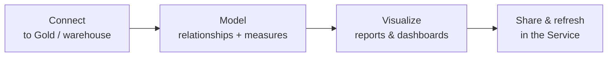

# Power BI Fundamentals (for Engineers)

## What is Power BI?

Power BI is Microsoft's business-intelligence platform for turning data into **interactive reports and dashboards**. For a data engineer, the key framing is: Power BI is the **consumer of your Gold layer** — the last mile that turns your Delta tables into charts a business user clicks through.

Analogy: your pipeline is a **water treatment plant** (raw → clean → potable); Power BI is the **kitchen tap** the resident actually uses. All your work is invisible to them; they judge the whole system by whether the tap gives clean water instantly. A great plant with a broken tap looks like failure — so engineers care about the tap.

---

## The pieces

| Piece | What it is |
|---|---|
| **Power BI Desktop** | Free Windows app to build data models, measures, and reports |
| **Power BI Service** | The cloud (app.powerbi.com) where reports are published, shared, and refreshed |
| **Semantic model (dataset)** | The data model — tables, relationships, measures — that reports sit on ([file 02](02_Semantic_Model_and_Star_Schema.md)) |
| **Report** | The pages of visuals built on a semantic model |
| **Dashboard** | A pinned single-page summary (Service only) |
| **Workspace** | A container for datasets/reports, with access control |
| **Gateway** | Bridges the Service to on-prem/private data sources for refresh |

The distinction engineers care about most: the **semantic model** (the data + logic) vs the **report** (the visuals). You influence the former; analysts own the latter.

---

## The three stages of a Power BI solution

As an engineer you're deeply involved in **Connect** and **Model**, lightly in **Visualize**, and you care about **Refresh** (it's a scheduled data job, which is your world).

---

## Power Query — the ETL inside Power BI

Power BI has its own transformation layer, **Power Query** (the "M" language), for shaping data on the way in. **Important engineering principle:** heavy transformation should happen **upstream in your pipeline** (Spark/dbt/Gold), *not* in Power Query. Power Query is for light, last-mile shaping — pushing real ETL into the report is a common anti-pattern that makes refreshes slow and logic un-shareable. **Do the work in Gold; let Power BI just consume.**

---

## Refresh — a scheduled data job you'll recognize

For **Import** models (see [file 02](02_Semantic_Model_and_Star_Schema.md)), Power BI holds a copy of the data and must **refresh** it on a schedule — this is literally a data pipeline:

- **Scheduled refresh** — e.g., after your nightly Gold load completes.
- **Incremental refresh** — only reload recent partitions, not the whole dataset (the same [incremental](../13_dbt/02_Models_and_Refs.md) idea, in Power BI).
- **Refresh failures** need monitoring like any [pipeline](../12_Monitoring_and_Observability/00_Monitoring_Learning_Path.md) — a failed refresh means stale dashboards.

Coordinating Gold-load completion → Power BI refresh is an orchestration concern engineers own ([Orchestration](../11_Orchestration/00_Orchestration_Learning_Path.md)).

---

## Licensing (know the tiers exist)

| Tier | Gist |
|---|---|
| **Free** | Personal use in Desktop; limited sharing |
| **Pro** | Per-user; share and collaborate in the Service |
| **Premium Per User / Capacity / Fabric** | Larger models, more refreshes, **Direct Lake**, dedicated capacity |

You don't need licensing depth, but know that **Premium/Fabric capacity** unlocks the big-data features (large models, Direct Lake) relevant to lakehouse serving ([file 04](04_Serving_from_the_Lakehouse.md)).

---

## Interview-grade Q&A

- *What's the difference between a semantic model and a report?* The semantic model is the data + relationships + measures; the report is the visuals built on top. Engineers own/influence the model.
- *Where should heavy transformation happen — Power Query or upstream?* Upstream in the pipeline (Spark/dbt/Gold). Power Query is for light last-mile shaping; pushing ETL into the report is an anti-pattern.
- *What is Power BI refresh and why does it matter to an engineer?* For Import models it reloads data on a schedule — a data job that must be orchestrated after the Gold load and monitored for failure (stale dashboards otherwise).
- *Desktop vs Service?* Desktop builds models/reports; the Service publishes, shares, schedules refresh, and manages access.
- *What is a gateway for?* Bridging the Power BI Service to on-prem/private data sources for refresh.

---

## Further Learning — Docs & Videos
- Power BI overview: https://learn.microsoft.com/power-bi/fundamentals/power-bi-overview
- Incremental refresh: https://learn.microsoft.com/power-bi/connect-data/incremental-refresh-overview
- Power Query: https://learn.microsoft.com/power-query/
- Video — Power BI basics: https://www.youtube.com/results?search_query=power+bi+beginner+tutorial
