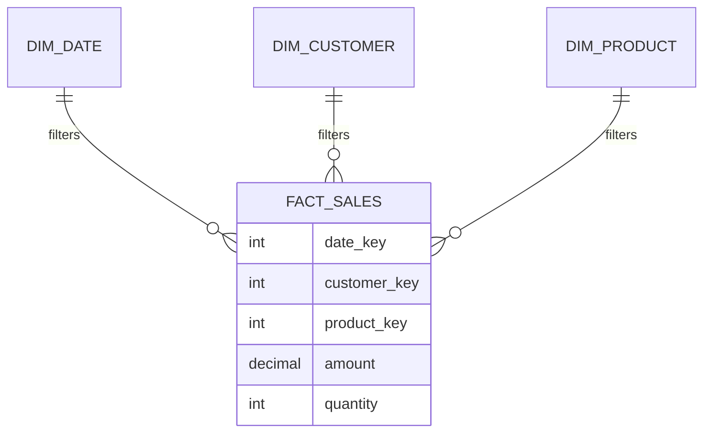

# Semantic Model & Star Schema

## What is a semantic model?

A semantic model (formerly "dataset") is the **data layer** a Power BI report sits on: the **tables**, the **relationships** between them, and the **measures** (calculations). It's where your Gold layer becomes a queryable, business-friendly model. This is the part of Power BI an **engineer most directly owns** — and where your [dimensional modeling](../02_Databases/Data_Modeling/03_Dimensional_Modeling.md) knowledge pays off.

Analogy: the semantic model is the **wiring diagram** of a house. The visuals (light fixtures) only work because the wiring correctly connects each switch to the right circuit. Get the wiring (relationships) right and everything downstream just works; get it wrong and lights flicker unpredictably (wrong totals).

---

## Why star schema is the right model for Power BI

Power BI's engine (**VertiPaq**, an in-memory columnar store) is **built and optimized for star schemas** — a central **fact** table surrounded by **dimension** tables. This isn't a preference; it's how the engine achieves speed.

- **Fact** = the measurable events (sales), at a defined **grain** (one row per order line).
- **Dimensions** = the descriptive context you slice by (date, customer, product).
- Filters flow **from dimensions to the fact**: pick a month in `DIM_DATE`, and `FACT_SALES` filters to it.

**Engineering takeaway:** build your **Gold layer as a star schema** and Power BI is fast and simple. Hand analysts a giant flat table or a normalized snowflake and reports get slow and confusing. *Your Gold design decides BI performance.*

---

## Relationships — the wiring

Relationships connect dimension keys to fact keys. Things engineers must get right:

- **Cardinality** — usually **one-to-many** (one customer → many sales). Many-to-many is possible but a red flag to double-check.
- **Filter direction** — normally **single** (dimension filters fact). Bidirectional filtering is occasionally needed but causes ambiguity and performance issues — avoid by default.
- **Surrogate keys** — clean integer keys from your Gold layer make relationships reliable and fast (the [surrogate key](../02_Databases/Data_Modeling/03_Dimensional_Modeling.md) idea, again).
- **A proper Date dimension** — mark a real date table as the model's date table so time intelligence works ([DAX](03_DAX_Basics.md)).

---

## Storage modes — the big architecture decision

How Power BI gets data from your Gold layer is a genuine engineering choice:

| Mode | How it works | Pros | Cons |
|---|---|---|---|
| **Import** | Data **copied** into Power BI's in-memory VertiPaq | Fastest queries; full DAX | Data is a copy; needs scheduled **refresh**; size limits |
| **DirectQuery** | Queries sent **live** to the source (Databricks/Synapse) at view time | Always current; no copy; huge data | Slower; source load; some DAX limits |
| **Composite** | Mix — import some tables, DirectQuery others | Flexibility | Complexity |
| **Direct Lake** (Fabric) | Reads **Delta/Parquet directly** from OneLake, no import, no query translation | Import-like speed **and** live data on big lakehouse data | Fabric-only ([file 04](04_Serving_from_the_Lakehouse.md)) |

- **Import** — the default; great for most cases where a scheduled refresh is acceptable.
- **DirectQuery** — when data is too big to import or must be real-time; you then care about *source* performance ([cost/performance](../15_Cost_and_Performance/00_Cost_and_Performance_Learning_Path.md)).
- **Direct Lake** — the modern lakehouse sweet spot: Fabric reads your Delta Gold tables directly, combining Import speed with live data. A hot topic and a strong thing to mention.

---

## What makes a semantic model fast (engineer's checklist)

- [ ] **Star schema**, not flat or snowflake
- [ ] Narrow tables — drop columns the report doesn't use (less memory, faster)
- [ ] Right data types; avoid high-cardinality text columns where possible
- [ ] Integer **surrogate keys** on relationships
- [ ] A dedicated **Date dimension** marked as such
- [ ] Single-direction relationships by default
- [ ] Aggregations pre-computed in **Gold**, not heavy DAX at query time

Most of these are *upstream* (Gold-layer) decisions — which is exactly why engineers own model performance.

---

## Interview-grade Q&A

- *Why is star schema recommended for Power BI?* Its VertiPaq engine is optimized for it — a central fact surrounded by dimensions gives fast, unambiguous filtering; flat/snowflake models are slower and harder.
- *Import vs DirectQuery?* Import copies data in-memory (fastest, needs refresh, size limits); DirectQuery queries the source live (always current, handles huge data, slower + source load).
- *What is Direct Lake?* A Fabric mode that reads Delta/Parquet directly from OneLake — Import-like speed with live data, no import or query translation.
- *How does your Gold design affect BI?* Directly — a clean star schema with surrogate keys and a date dimension makes reports fast; a flat/normalized Gold makes them slow and error-prone.
- *What's the risk of bidirectional relationships?* Ambiguous filter paths and performance problems — use single-direction by default.
- *Where should aggregations be computed?* Pre-computed in Gold where possible, not as heavy DAX at query time.

---

## Further Learning — Docs & Videos
- Star schema guidance: https://learn.microsoft.com/power-bi/guidance/star-schema
- Storage modes: https://learn.microsoft.com/power-bi/connect-data/desktop-storage-mode
- Direct Lake (Fabric): https://learn.microsoft.com/fabric/get-started/direct-lake-overview
- Video — Power BI star schema & modeling: https://www.youtube.com/results?search_query=power+bi+star+schema+data+modeling
