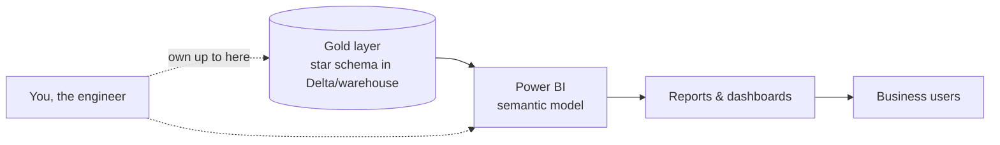

# Power BI for Engineers — Learning Path

Power BI is the **serving layer** — where all your pipeline work finally becomes something a human looks at and makes decisions on. You're **not** becoming a BI analyst; you're learning **just enough Power BI to serve your Gold layer well** and to speak the language of your main consumers. A data engineer who understands what BI needs builds better Gold tables — and it's a Phase 7 🔜 gap the [ROADMAP](../ROADMAP.md) flagged.

Builds on [Dimensional Modeling](../02_Databases/Data_Modeling/03_Dimensional_Modeling.md), [Lakehouse](../04_Storage_and_Formats/Lakehouse/03_Lakehouse_Architecture.md), and [Synapse/Fabric](../10_Synapse_and_Fabric/00_Learning_Path.md).

---

## Why an engineer should learn Power BI

- BI is the **destination** of most pipelines. If you don't know what it needs, you build Gold tables that are painful to report on.
- The **star schema** you learned isn't academic — it's *exactly* what makes Power BI fast. Your modeling choices directly determine dashboard performance.
- **Import vs DirectQuery**, **Direct Lake**, and semantic models are architecture decisions engineers own.
- Interviews ask "how does your data get to the business?" — Power BI is the answer, and knowing the handoff shows end-to-end thinking.

---

## What you do NOT need

You don't need to master visuals, themes, or storytelling — that's the analyst's craft. Focus on the **engineer-relevant** parts: connectivity, the semantic model, star-schema serving, and enough DAX to sanity-check measures.

---

## Reading order

| # | File | What you'll learn |
|---|------|-------------------|
| 01 | [Power BI Fundamentals](01_Power_BI_Fundamentals.md) | The pieces (Desktop/Service), datasets, reports, refresh — for engineers |
| 02 | [Semantic Model & Star Schema](02_Semantic_Model_and_Star_Schema.md) | Why star schema, relationships, Import vs DirectQuery vs Direct Lake |
| 03 | [DAX Basics](03_DAX_Basics.md) | Measures vs columns, key functions, enough to verify numbers |
| 04 | [Serving from the Lakehouse](04_Serving_from_the_Lakehouse.md) | Connecting to Databricks/Fabric/Synapse; the engineer's handoff |
| — | [Interview Questions & Answers](Interview_Questions_and_Answers.md) | Test yourself across the module |

---

## Where Power BI sits (your pipeline's last mile)

The dotted line matters: engineers typically own **up to the semantic model**; analysts build the visuals. Your job is to hand off a **clean, well-modeled Gold layer** and often the semantic model on top.

Start here: **[01 — Power BI Fundamentals](01_Power_BI_Fundamentals.md)**.

## Further Learning — Docs & Videos
- Power BI documentation: https://learn.microsoft.com/power-bi/
- Star schema in Power BI: https://learn.microsoft.com/power-bi/guidance/star-schema
- Video — Power BI for data engineers: https://www.youtube.com/results?search_query=power+bi+for+data+engineers
