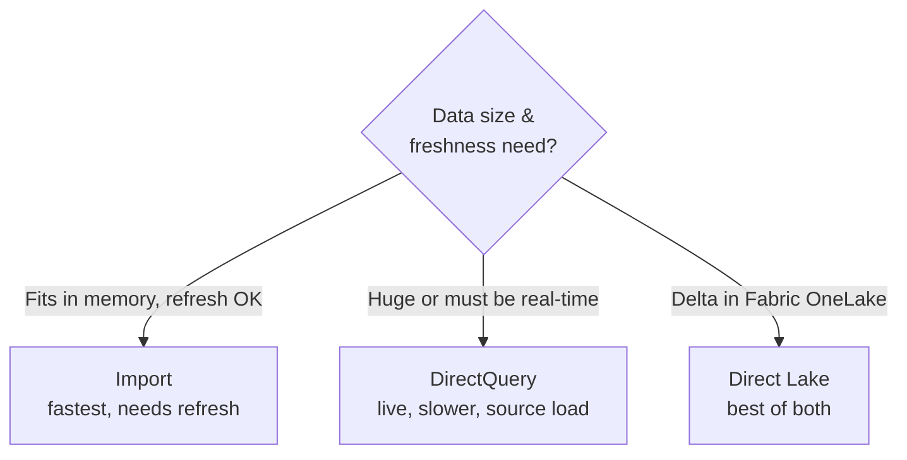

# Serving from the Lakehouse

## The engineer's real job: the handoff

This is the note that matters most for a data engineer. Your pipelines end at the **Gold layer**; Power BI begins there. **How you connect them** — and how well you shaped Gold — determines whether the business gets fast, correct dashboards or slow, wrong ones. This is the "last mile" you own.

Analogy: you've delivered goods to the **loading dock** (Gold). The connection to Power BI is the **dock door**. A well-designed dock (clean star schema, right connection mode) means trucks load in minutes; a bad one (flat tables, wrong mode) means chaos every morning — even though the goods themselves are fine.

---

## How Power BI connects to your Gold layer

| Source | Connector | Typical mode |
|---|---|---|
| **Databricks** (Delta via SQL Warehouse) | Azure Databricks connector | Import or DirectQuery |
| **Microsoft Fabric** (Lakehouse/Warehouse) | Native (OneLake) | **Direct Lake**, Import, DirectQuery |
| **Synapse** (dedicated/serverless SQL) | Azure Synapse connector | Import or DirectQuery |
| **Azure SQL** | SQL Server connector | Import or DirectQuery |
| **ADLS files** | Direct file connect (less common for serving) | Import |

The two you'll meet most in a modern Azure lakehouse: **Databricks SQL Warehouse** (Delta Gold → Power BI) and **Fabric Direct Lake** (Delta in OneLake → Power BI with no import). ([Synapse/Fabric](../10_Synapse_and_Fabric/00_Learning_Path.md))

---

## Direct Lake — the modern lakehouse serving mode

**Direct Lake** (Fabric) is a genuine step change worth understanding:

- **Import** copies data (fast queries, but stale between refreshes and size-limited).
- **DirectQuery** queries live (current, but slow and loads the source).
- **Direct Lake** reads your **Delta/Parquet files directly from OneLake** into memory on demand — giving **Import-like speed with live data and no scheduled refresh or query translation.**

For an engineer, Direct Lake means: **land clean Delta Gold tables in the Fabric Lakehouse, and Power BI serves them at full speed without a copy or a refresh job.** It removes the refresh-orchestration burden entirely for Fabric shops — a strong, current talking point.

---

## Choosing the connection mode (your decision)

- Most cases → **Import** with a scheduled refresh after the Gold load.
- Real-time / too-big-to-import → **DirectQuery** (then *your source* performance and [cost](../16_Cost_and_Performance/03_Storage_and_Query_Cost.md) matter, because every visual queries it live).
- Fabric lakehouse → **Direct Lake**.

---

## What you must give Power BI for a good handoff

A great serving layer is a **modeling and engineering deliverable**, not luck:

- [ ] **Gold as a star schema** — facts + conformed dimensions ([modeling](02_Semantic_Model_and_Star_Schema.md))
- [ ] **Surrogate keys** for clean, fast relationships
- [ ] A proper **Date dimension** for time intelligence
- [ ] **Pre-computed aggregates/business logic** in Gold, so DAX stays light ([DAX](03_DAX_Basics.md))
- [ ] **Narrow tables** — only the columns the report needs
- [ ] **Well-sized Delta files** (`OPTIMIZE`) so DirectQuery/Direct Lake reads are fast
- [ ] A **reliable refresh** coordinated with the Gold load ([orchestration](../12_Orchestration/00_Orchestration_Learning_Path.md)) and monitored ([monitoring](../13_Monitoring_and_Observability/00_Monitoring_Learning_Path.md))

Notice how many are *upstream* decisions — the quality of the dashboard is largely determined **before Power BI is even opened**.

---

## Refresh orchestration & governance

- **Sequence the refresh after Gold** — trigger Power BI dataset refresh (via ADF/Databricks/Fabric pipeline or the Power BI API) *once the Gold load succeeds*, so dashboards never show partially-loaded data.
- **Row-Level Security (RLS)** — filter what each user sees (a regional manager sees only their region), often defined in the semantic model — a [governance](../05_Data_Engineering/Data_Governance/01_Data_Governance_and_Security.md) concern.
- **Certified/endorsed datasets** — mark the trusted semantic model so analysts build on the governed one, not a rogue copy.

---

## Interview-grade Q&A

- *How does your data get from the lakehouse to Power BI?* Connect Power BI to the Gold layer via the platform connector (Databricks SQL Warehouse, Fabric OneLake, Synapse) using Import, DirectQuery, or Direct Lake.
- *What is Direct Lake and why does it matter?* A Fabric mode that reads Delta/Parquet directly from OneLake — Import-like speed with live data, no import or refresh job — ideal for lakehouse serving.
- *When Import vs DirectQuery?* Import for most cases (fast, refresh acceptable); DirectQuery for real-time or too-big-to-import data, accepting slower queries and source load.
- *What makes a good Gold-to-BI handoff?* A star schema with surrogate keys and a date dimension, pre-computed aggregates, narrow well-sized Delta tables, and a reliable monitored refresh.
- *How do you ensure dashboards don't show half-loaded data?* Trigger the Power BI refresh only after the Gold load succeeds (orchestrated), and monitor refresh failures.
- *What is Row-Level Security?* Semantic-model rules that filter data per user (e.g., region), so users see only what they're permitted to.

---

## Further Learning — Docs & Videos
- Connect Databricks to Power BI: https://learn.microsoft.com/azure/databricks/partners/bi/power-bi
- Direct Lake (Fabric): https://learn.microsoft.com/fabric/get-started/direct-lake-overview
- Row-Level Security: https://learn.microsoft.com/power-bi/enterprise/service-admin-rls
- Video — Power BI + Databricks/Fabric serving: https://www.youtube.com/results?search_query=power+bi+direct+lake+fabric+databricks
