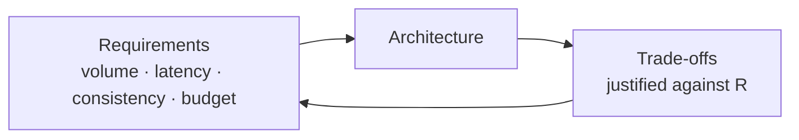

# Data Engineering System Design — Learning Path

At 3+ years, interviews stop asking only "write this query" and start asking **"design a system to do X."** *"Design a pipeline to ingest 10M events/sec and serve a real-time dashboard."* *"How would you build the data platform for a ride-hailing app?"* These **system design** questions test whether you can combine everything — storage, modeling, pipelines, streaming, orchestration, cost — into a coherent architecture. This module teaches the **framework** for answering them.

It's the capstone: it assumes the rest of the repo and ties it together.

---

## Why system design is the senior filter

- Junior questions test **knowledge** (what is a shuffle?). Senior questions test **judgment** (given constraints, what would you build and *why*?).
- There's rarely one right answer — interviewers watch **how you reason**: do you ask about requirements, weigh trade-offs, and justify choices?
- It's the difference between someone who *implements* a design and someone who *creates* one — i.e., the difference in pay grade.

---

## Reading order

| # | File | What you'll learn |
|---|------|-------------------|
| 01 | [The Design Framework](01_Design_Framework.md) | A repeatable method: requirements → volume → architecture → trade-offs |
| 02 | [Batch Pipeline Design](02_Batch_Pipeline_Design.md) | Designing batch systems; worked example |
| 03 | [Streaming & Real-Time Design](03_Streaming_and_Realtime_Design.md) | Lambda/Kappa, latency, exactly-once; worked example |
| 04 | [Case Studies](04_Case_Studies.md) | Several full "design an X" walkthroughs |
| — | [Interview Questions & Answers](Interview_Questions_and_Answers.md) | Practice prompts + how to attack them |

---

## The core idea: there is no "best," only "best for the requirements"

Every design question is really: *"do you gather requirements and justify trade-offs?"* The candidate who says "I'd use Kafka and Spark" immediately loses to the one who says **"first, what's the volume, latency need, and budget? — because that changes everything."**

Requirements drive architecture; trade-offs are judged against requirements. Master that loop and you can answer any design prompt — even about tools you've never used.

Start here: **[01 — The Design Framework](01_Design_Framework.md)**.

## Further Learning — Docs & Videos
- Designing Data-Intensive Applications (Kleppmann) — the canonical book: https://dataintensive.net/
- Azure Architecture Center — data patterns: https://learn.microsoft.com/azure/architecture/data-guide/
- Video — data engineering system design: https://www.youtube.com/results?search_query=data+engineering+system+design+interview
