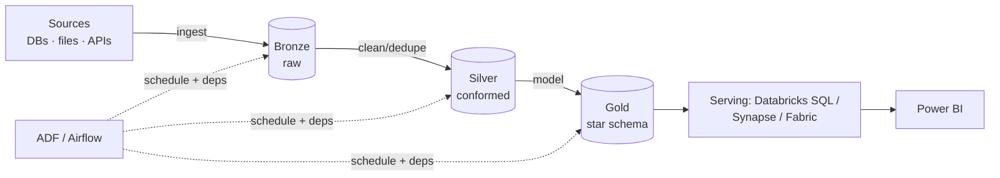

# Batch Pipeline Design

## When batch is the right answer

**Batch** processes data in scheduled chunks (hourly, nightly). It's the **default** for analytics because it's simpler, cheaper, and easier to reason about than streaming — and most business questions ("yesterday's sales," "this month's churn") don't need sub-second freshness.

Analogy: batch is the **postal service** — mail is collected, sorted, and delivered on a schedule. It's efficient and reliable for the vast majority of letters. You only need a **courier** (streaming) for the rare urgent package. Reaching for streaming when batch suffices is paying courier prices to send birthday cards.

**Choose batch when:** the SLA is minutes-to-days, data arrives in files/periodic extracts, and you value simplicity and cost over latency.

---

## The batch design template

Applying the [framework](01_Design_Framework.md), a batch design almost always follows the **medallion** shape:

The design decisions layered on top are what an interviewer probes.

---

## The key batch design decisions

### 1. Full load vs incremental
- **Full load** — reprocess everything each run. Simple; fine for small data; wasteful and slow at scale.
- **Incremental** — process only new/changed data via a **watermark** (`modified_date`) or **CDC** ([Change Data Capture](../06_Data_Engineering/Data_Integration/03_Change_Data_Capture.md)). The scalable default.

"How do you know what's new?" → watermark column or CDC. A guaranteed follow-up.

### 2. Idempotency & reruns
Design so a **rerun or backfill is safe** — MERGE/upsert on business keys, partition overwrite keyed by run date ([reliability](../12_Monitoring_and_Observability/03_Pipeline_Reliability.md)). Batch jobs fail and get rerun; non-idempotent ones corrupt data.

### 3. Partitioning & file layout
Partition Gold by the column reports filter on (usually **date**), keep files well-sized (`OPTIMIZE`), so serving scans little ([cost](../15_Cost_and_Performance/03_Storage_and_Query_Cost.md)).

### 4. Orchestration & dependencies
Dims before facts; aggregate after both; retries and failure alerts ([orchestration](../11_Orchestration/00_Orchestration_Learning_Path.md)).

### 5. Data quality gates
Validate at Bronze→Silver, quarantine bad rows, alert on volume anomalies ([quality](../14_Testing_and_DataOps/02_Data_Quality_Testing.md)).

---

## Worked example — "Design a daily sales analytics platform"

**Requirements (Step 1–2):** nightly retail data from an operational SQL DB + daily CSV feeds; ~50 GB/day; consumers are finance analysts via a Power BI dashboard needing data by 6 AM; must handle customers changing address; moderate budget.

**Architecture (Step 3):**
- **Ingest** — ADF Copy from the SQL source (**incremental** via `modified_date` watermark) + Auto Loader for the CSV feeds → Bronze.
- **Store** — ADLS Gen2 + Delta, medallion layout.
- **Process** — Databricks/Spark: Bronze→Silver (clean, dedupe, quarantine) → Gold star schema; **SCD2** on the customer dimension via Delta MERGE ([SCD](../02_Databases/Data_Modeling/04_Slowly_Changing_Dimensions.md)).
- **Serve** — Databricks SQL Warehouse → Power BI (Import, refresh triggered after Gold).
- **Orchestrate** — ADF tumbling-window trigger; Copy → Databricks job → Power BI refresh; retries + failure alert.

**Trade-offs (Step 4):**
- *Batch, not streaming* — SLA is daily; streaming adds cost/complexity for no benefit.
- *Lakehouse, not pure warehouse* — mixed structured + semi-structured, cheaper storage, ACID via Delta.
- *Incremental, not full load* — 50 GB/day makes full reloads slow and costly.

**Cross-cutting (Step 5):** idempotent MERGE for safe reruns; quality gates + quarantine; freshness alert for the 6 AM SLA; Unity Catalog for access/lineage; job clusters + spot for cost; partition by date + OPTIMIZE.

That structure — requirements → architecture → justified trade-offs → cross-cutting — is a **complete, senior answer**.

---

## Interview-grade Q&A

- *When do you choose batch over streaming?* When the SLA is minutes-to-days, data comes in periodic files/extracts, and simplicity/cost matter more than latency — the default for analytics.
- *Full load vs incremental — how do you decide and implement?* Incremental for scale, via a watermark column or CDC; full load only for small data. Track "what's new" with `modified_date` or change capture.
- *How do you make a batch pipeline safe to rerun?* Idempotency — MERGE/upsert on business keys or partition overwrite by run date.
- *How do you handle a dimension that changes over time?* SCD2 (valid_from/valid_to/is_current) via Delta MERGE.
- *Walk me through a daily analytics platform.* Requirements → medallion on ADLS/Delta with incremental ingest, Spark transforms + SCD2, star-schema Gold served to Power BI, orchestrated by ADF with quality/monitoring/cost addressed.

---

## Further Learning — Docs & Videos
- Medallion architecture: https://learn.microsoft.com/azure/databricks/lakehouse/medallion
- Batch processing patterns (Azure): https://learn.microsoft.com/azure/architecture/data-guide/big-data/batch-processing
- Video — batch data pipeline design: https://www.youtube.com/results?search_query=batch+data+pipeline+architecture+design
