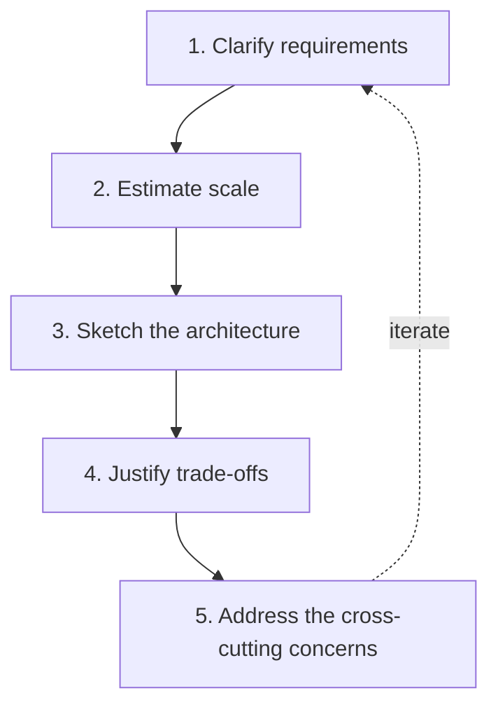
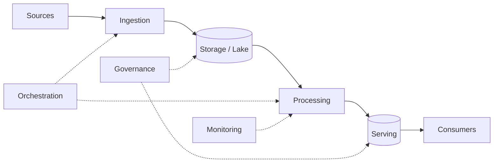

# The Data System Design Framework

## Why you need a framework

A system design question ("design a data platform for X") is open-ended on purpose. Without a method, candidates ramble, name-drop tools, and miss the point. With a **repeatable framework**, you look structured and senior — and you can tackle a prompt about a domain or tool you've never touched.

Analogy: system design is like being an **architect asked to design a building**. A bad architect immediately starts drawing walls. A good one asks: *how many people, what's it for, what's the budget, what's the plot size, earthquake zone?* — because a hospital and a warehouse for the same footprint are utterly different buildings. **Requirements first, always.**

---

## The 5-step framework

### Step 1 — Clarify requirements (never skip this)

Ask before you design. The key questions:

- **What's the goal?** What decisions/products does this data serve? (a dashboard? an ML model? an API?)
- **Batch or real-time?** What's the required **latency** — daily, hourly, seconds? This single answer reshapes everything.
- **Volume** — how much data, how many events/sec, growth rate?
- **Consistency** — must it be exact (finance) or is eventual OK (analytics)? ([CAP](../02_Databases/NoSQL/06_CAP_Theorem_and_Consistency.md))
- **Who consumes it** and how? (analysts via SQL, apps via API, data scientists)
- **Budget & team** — cost sensitivity, existing stack, team skills.

Stating "I'd first clarify these" *is* the first points you score.

### Step 2 — Estimate scale

Rough numbers drive tool choices. "10 GB/day" and "10 TB/hour" need different architectures.

- Data volume/day, peak events/sec, total retained size.
- Read vs write ratio; query patterns.
- These decide: single-node vs Spark, batch vs streaming, storage tier, partition strategy.

A back-of-envelope estimate shows engineering maturity — you size before you build.

### Step 3 — Sketch the architecture

Draw the **flow**, naming a component (not necessarily a brand) at each hop. Default to the layered pattern you already know:

Then map each box to a concrete choice **justified by the requirements** — e.g., "Event Hubs for ingestion *because* the requirement is 50k events/sec real-time."

### Step 4 — Justify trade-offs

This is where you win or lose. For each major choice, name the **alternative and why you didn't pick it**:

- "Batch, not streaming, because the SLA is daily and streaming adds cost/complexity we don't need."
- "Delta lakehouse over a warehouse because we have semi-structured data and want cheap storage + ACID."
- "Eventual consistency is fine here because it's analytics, not payments."

Trade-offs > tools. There's no perfect choice, only justified ones.

### Step 5 — Address cross-cutting concerns

Strong candidates proactively cover what juniors forget:

- **Reliability** — retries, idempotency, failure handling ([reliability](../13_Monitoring_and_Observability/03_Pipeline_Reliability.md))
- **Data quality** — validation, quarantine ([quality](../15_Testing_and_DataOps/02_Data_Quality_Testing.md))
- **Monitoring & observability** ([monitoring](../13_Monitoring_and_Observability/00_Monitoring_Learning_Path.md))
- **Security & governance** — access, PII, lineage ([governance](../05_Data_Engineering/Data_Governance/01_Data_Governance_and_Security.md))
- **Cost** — right-sizing, the bill implication ([cost](../16_Cost_and_Performance/00_Cost_and_Performance_Learning_Path.md))
- **Scalability & evolution** — how it grows 10×, how schema change is handled

---

## The universal reference architecture

Almost every batch/analytics design is a specialization of this — memorize it as your starting canvas:

| Layer | Job | Common choices |
|---|---|---|
| **Ingestion** | Get data in | ADF, Auto Loader, Event Hubs/Kafka, Fivetran |
| **Storage** | Land it cheaply/reliably | ADLS + Delta (lakehouse) |
| **Processing** | Clean/transform (medallion) | Databricks/Spark, dbt |
| **Serving** | Make it queryable | Databricks SQL, Synapse, Fabric, Cosmos DB |
| **Consumption** | Deliver it | Power BI, APIs, ML |
| **Orchestration** | Run it on schedule | ADF, Airflow, Workflows |
| **Governance/Monitoring** | Trust it | Purview/Unity Catalog, Azure Monitor |

You're not memorizing an answer — you're memorizing a **canvas** you adapt per requirements.

---

## Interview-grade Q&A

- *What's the first thing you do in a system design question?* Clarify requirements — goal, latency (batch vs real-time), volume, consistency, consumers, budget — before proposing any tool.
- *Why estimate scale early?* Rough volume/throughput numbers drive the tool and architecture choices (single-node vs Spark, batch vs streaming, partitioning).
- *What separates a strong design answer from a weak one?* Justified **trade-offs** tied to requirements, not tool name-dropping; and covering cross-cutting concerns (reliability, quality, cost, governance).
- *What's your default data architecture?* Layered: ingestion → lake storage (Delta) → medallion processing → serving → consumption, with orchestration, governance, and monitoring across it.
- *How do you handle "there's no single right answer"?* Explicitly: state the alternative for each choice and why the requirements make your pick better.

---

## Further Learning — Docs & Videos
- Azure Architecture Center (data): https://learn.microsoft.com/azure/architecture/data-guide/
- Designing Data-Intensive Applications: https://dataintensive.net/
- Video — how to approach system design: https://www.youtube.com/results?search_query=data+engineering+system+design+framework
