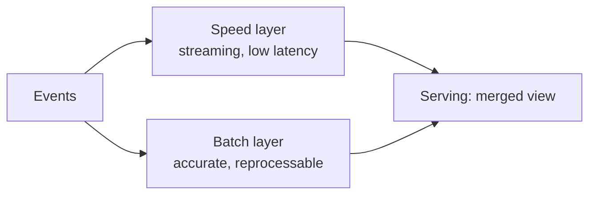

# Streaming & Real-Time Design

## When real-time is actually required

**Streaming** processes data continuously as it arrives, for **seconds-to-minutes** latency. It's more powerful than batch — and more expensive and complex. The senior move is knowing when you **genuinely need** it versus when batch (or micro-batch) suffices.

Analogy: streaming is a **live TV broadcast** vs batch's **recorded show**. Live is thrilling and necessary for a sports final — but you don't broadcast a cooking tutorial live just because you *can*; the recording is cheaper, editable, and just as useful. Reserve "live" for when the value truly decays in seconds.

**Genuinely need real-time when:** fraud detection, live ops dashboards, alerting, IoT control, personalization/recommendations, dynamic pricing — cases where a decision made **now** beats the same decision made in an hour.

---

## Lambda vs Kappa — the two classic architectures

### Lambda architecture
Run **two paths**: a **batch layer** (accurate, complete, slow) and a **speed layer** (fast, approximate), then merge them for serving.

- ✅ Best-of-both: fast *and* eventually accurate.
- ❌ **Two codebases** for the same logic — complex and error-prone to keep in sync.

### Kappa architecture
**One streaming path** for everything; reprocess by **replaying** the event log. Simpler — one codebase — and favored by the modern lakehouse (Delta + Structured Streaming can do both live and reprocessing).

The modern trend leans **Kappa** (or "just use Delta streaming for both") to avoid Lambda's dual-maintenance pain. Knowing both, and the trend, is a strong senior signal.

---

## The core streaming design decisions

### 1. Delivery semantics
- **At-most-once** — may lose data (rarely acceptable).
- **At-least-once** — no loss, possible duplicates (needs dedup downstream).
- **Exactly-once** — no loss, no dupes — the gold standard, achieved via **checkpointing + idempotent sinks** ([Structured Streaming](../06_Programming/PySpark/13_Structured_Streaming.md)).

### 2. Windowing & time
Aggregate over **windows** (tumbling/sliding/session) and choose **event time vs processing time**. Handle **late data** with **watermarks** that bound state ([Project 2](../11_Projects/03_Project_2_Streaming_Pipeline.md)).

### 3. State & fault tolerance
Streaming jobs hold **state** (running aggregates, dedup sets). **Checkpointing** persists offsets + state so a crash resumes correctly. Watermarks keep state from growing forever.

### 4. Backpressure & scaling
What happens when input spikes faster than you process? Partitioned ingestion (Event Hubs/Kafka partitions), autoscaling consumers, and buffering. Ordering guarantees are usually **per-partition**, which shapes your keys.

---

## Worked example — "Design real-time fraud detection"

**Requirements:** score card transactions for fraud in **< 1 second**; ~20k txns/sec peak; must not lose a transaction; flagged transactions trigger an alert; also need historical data for model training.

**Architecture:**
- **Ingest** — transactions → **Event Hubs/Kafka** (partitioned by card/account for ordering & scale).
- **Process** — **Spark Structured Streaming** (or Flink): enrich each txn, apply the fraud model/rules, with **checkpointing** for exactly-once and **watermarking** for late events.
- **Serve (speed)** — flagged txns → an alerting topic + a low-latency store (**Cosmos DB/Redis**) the ops app reads in ms.
- **Serve (batch/history)** — **all** txns also land in **Delta Bronze** (Kappa-style: one stream feeds both live scoring and the historical lake for training).
- **Orchestrate/monitor** — streaming job health, **lag/backpressure** metrics, freshness alerts.

**Trade-offs:**
- *Streaming, not batch* — the < 1s SLA demands it (fraud value decays in seconds).
- *Kappa over Lambda* — one Structured Streaming codebase feeds both live and historical, avoiding dual maintenance.
- *Exactly-once* — financial data can't be lost or double-counted → checkpointing + idempotent writes.
- *Cosmos DB/Redis serving* — millisecond point reads for the live decision.

---

## Streaming vs batch — the decision table

| Factor | Batch | Streaming |
|---|---|---|
| Latency | minutes–days | seconds |
| Complexity/cost | lower | higher |
| Reprocessing | easy (rerun) | replay the log (Kappa) |
| Use when | most analytics | fraud, live ops, alerting, IoT |

Default to batch; justify streaming by a **real latency requirement**. Saying that *is* the senior answer.

---

## Interview-grade Q&A

- *When do you genuinely need streaming?* When a decision's value decays in seconds — fraud, live dashboards, alerting, IoT, personalization — not just "real-time sounds nice."
- *Lambda vs Kappa?* Lambda runs separate batch + speed layers (accurate + fast, but two codebases); Kappa uses one streaming path and replays for reprocessing (simpler, modern-lakehouse-friendly).
- *How do you achieve exactly-once?* Checkpointing (offset + state tracking) plus idempotent sinks (e.g., Delta MERGE).
- *How do you handle late-arriving data?* Event-time windows with watermarks that define how long to wait and bound state.
- *How do you scale a stream under load spikes?* Partitioned ingestion (Event Hubs/Kafka), autoscaling consumers, and buffering; ordering is typically per-partition, so key accordingly.
- *Walk through real-time fraud detection.* Event Hubs → Structured Streaming scoring (checkpointing/watermark, exactly-once) → low-latency store + alert for the live path, and Delta Bronze for history (Kappa) — justified by the sub-second, no-loss requirement.

---

## Further Learning — Docs & Videos
- Lambda vs Kappa: https://learn.microsoft.com/azure/architecture/data-guide/big-data/
- Structured Streaming: https://learn.microsoft.com/azure/databricks/structured-streaming/
- Stream processing patterns: https://learn.microsoft.com/azure/architecture/data-guide/big-data/real-time-processing
- Video — Lambda vs Kappa architecture: https://www.youtube.com/results?search_query=lambda+vs+kappa+architecture
