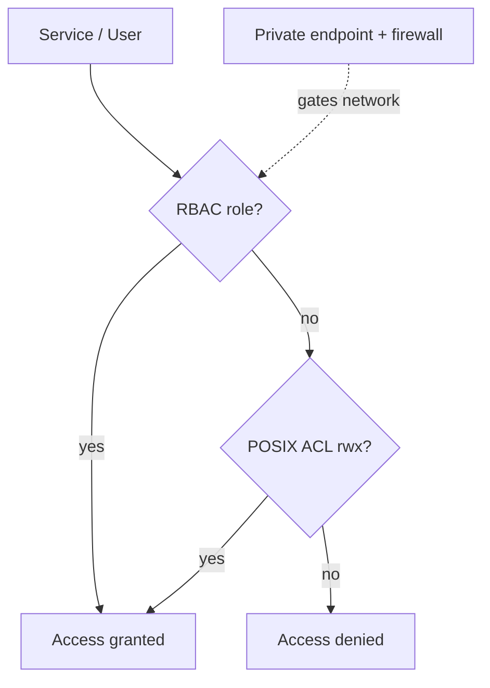

# Azure Data Lake Storage Gen2 — Interview Questions

## Overview
ADLS Gen2 = Azure Blob Storage + a **hierarchical namespace (HNS)**, purpose-built for big-data analytics. It's the storage backbone (Bronze/Silver/Gold) of nearly every Azure data platform. Interviews test HNS, security (RBAC/ACLs/MSI), performance, lifecycle/cost, and networking.

---

## Frequently Asked Interview Questions

| # | Question | Difficulty | Confidence |
|---|---|---|---|
| 1 | What is ADLS Gen2? Difference from Blob Storage? | 🟢 | ★★★★★ |
| 2 | What is the hierarchical namespace (HNS)? Why it matters? | 🟡 | ★★★★★ |
| 3 | RBAC vs ACLs vs SAS vs account keys? | 🔴 | ★★★★★ |
| 4 | How does Databricks access ADLS securely? | 🔴 | ★★★★★ |
| 5 | How does ADF access ADLS securely? | 🟡 | ★★★★★ |
| 6 | Access tiers (Hot/Cool/Cold/Archive)? | 🟡 | ★★★★☆ |
| 7 | Redundancy options (LRS/ZRS/GRS/GZRS)? | 🟡 | ★★★★☆ |
| 8 | How do you organize a lake (zones/folders)? | 🟡 | ★★★★★ |
| 9 | Lifecycle management for cost? | 🟡 | ★★★★☆ |
| 10 | Private endpoints / firewall / VNet? | 🔴 | ★★★★☆ |
| 11 | Small-file problem in the lake? | 🟡 | ★★★☆☆ |
| 12 | ADLS Gen2 vs Gen1? | 🟢 | ★★★☆☆ |
| 13 | How is ADLS billed? Cost optimization? | 🟡 | ★★★★☆ |
| 14 | POSIX ACL permission levels & inheritance? | 🔴 | ★★★☆☆ |
| 15 | Order of evaluation: RBAC vs ACL? | 🔴 | ★★★☆☆ |
| 16 | Soft delete / versioning / snapshots? | 🟡 | ★★★☆☆ |
| 17 | How do you mount ADLS in Databricks (and why avoid)? | 🟡 | ★★★☆☆ |
| 18 | Partitioning strategy in the lake? | 🟡 | ★★★★☆ |
| 19 | Encryption (at rest / CMK)? | 🟡 | ★★★☆☆ |
| 20 | How do you handle GDPR delete in the lake? | 🔴 | ★★★☆☆ |

---

## Detailed Answers

### Q1/Q2. ADLS Gen2 vs Blob + Hierarchical Namespace
Blob is a **flat** object store (folders are just name prefixes). ADLS Gen2 adds **HNS** = real directories, so **rename/delete of a folder is atomic and cheap** (one metadata op vs touching every blob), plus **POSIX ACLs** and analytics-optimized driver (ABFS). HNS must be enabled **at account creation** (hard to change later). Everything Spark does (directory listing, atomic commit) is faster with HNS.

### Q3. RBAC vs ACLs vs SAS vs keys (top security question)
| Mechanism | Scope | Use |
|---|---|---|
| **RBAC** | Account / container level (e.g., `Storage Blob Data Contributor`) | Coarse-grained, role-based |
| **POSIX ACLs** | Per file/folder (rwx for users/groups) | Fine-grained access within a container |
| **SAS token** | Time-limited signed URL | Temporary, scoped delegated access |
| **Account key** | Full account | ❌ Avoid — all-or-nothing, hard to rotate |

Best practice: **RBAC + Managed Identity** for services, **ACLs** for granular folder-level control, **SAS** only for temporary external sharing, never account keys.

### Q4. Databricks → ADLS securely (ranked best → worst)
1. **Unity Catalog external location + storage credential (Access Connector / managed identity)** — governed, no secrets. *Preferred today.*
2. **Service Principal + OAuth**, client secret in a **Key Vault-backed secret scope**.
3. Cluster-scoped SP config.
4. ❌ Account keys / mounts with keys.

### Q5. ADF → ADLS securely
Use ADF's **system-assigned Managed Identity** granted `Storage Blob Data Contributor` on the container. No keys/SAS in linked services.

### Q14/Q15. ACL levels & evaluation order
ACLs have **Access ACLs** (control access to an item) and **Default ACLs** (templates children inherit). Permissions: r/w/x (x = traverse a directory). **Evaluation order: RBAC is checked first; if RBAC grants access, ACLs aren't evaluated.** ACLs only matter for principals without a data-plane RBAC role. New files don't inherit existing ACLs retroactively — set **default ACLs** beforehand.

### Q6/Q7. Tiers & redundancy
Tiers: **Hot** (frequent), **Cool** (≥30 days), **Cold** (≥90 days), **Archive** (≥180 days, offline, hours to rehydrate). Redundancy: **LRS** (1 datacenter) → **ZRS** (zones) → **GRS** (+paired region async) → **GZRS/RA-GZRS** (zones + region + read access).

### Q8. Lake zones
`raw/bronze` (immutable as-ingested) → `silver` (cleaned/conformed) → `gold` (curated/aggregated). Separate containers per zone or per domain; consistent naming (`/domain/entity/yyyy/mm/dd/`); Delta/Parquet formats.

---

## Scenario Questions

**🔴 S1. "Secure the lake for an auditor." ★★★★★**
Managed Identity + RBAC (no keys), ACLs for granular folder access, **private endpoints + firewall** (deny public), diagnostic logs to Log Analytics, **CMK** if mandated, soft delete on. Document least-privilege per zone.

**🟡 S2. "Storage cost is high." ★★★★☆**
**Lifecycle policy**: auto-tier Hot→Cool→Archive by last-modified, delete temp/old versions; **compact small files** (OPTIMIZE); right redundancy (don't over-buy GRS); VACUUM orphaned Delta files.

**🟡 S3. "Millions of small files slow Spark." ★★★★☆**
Compact via Delta OPTIMIZE / optimized writes; land larger files; avoid per-record writes; target ~128MB–1GB.

**🔴 S4. "Team A reads gold; only Team B writes silver." ★★★☆☆**
RBAC for broad read; **default ACLs** on the silver folder granting write to Team B's **group** only.

**🔴 S5. "GDPR: delete a user's data." ★★★☆☆**
In Delta: `DELETE FROM t WHERE user_id=...` then `VACUUM` to physically remove files (respect retention); ensure no lingering copies across zones.

---

## Hands-on Questions
- **Create** a governed external location for Databricks (Access Connector MI → `Storage Blob Data Contributor` → UC external location).
- **Secure** ADLS with no public access (private endpoint + firewall deny + MSI).
- **Set up** auto-tiering (lifecycle rule by last-modified days).
- **Debug** an access-denied error (check RBAC role → ACLs → network/firewall → identity used).

---

## Code Examples
```python
# Databricks: read ADLS via SP + Key Vault secret scope (no keys in code)
spark.conf.set("fs.azure.account.auth.type.<acct>.dfs.core.windows.net", "OAuth")
spark.conf.set("fs.azure.account.oauth.provider.type.<acct>.dfs.core.windows.net",
    "org.apache.hadoop.fs.azurebfs.oauth2.ClientCredsTokenProvider")
spark.conf.set("fs.azure.account.oauth2.client.id.<acct>.dfs.core.windows.net", client_id)
spark.conf.set("fs.azure.account.oauth2.client.secret.<acct>.dfs.core.windows.net",
    dbutils.secrets.get("kv-scope","adls-sp-secret"))
df = spark.read.format("delta").load("abfss://gold@<acct>.dfs.core.windows.net/orders")
```
```bash
# Azure CLI: grant a managed identity data access (RBAC, not keys)
az role assignment create --assignee <mi-object-id> \
  --role "Storage Blob Data Contributor" \
  --scope /subscriptions/<sub>/resourceGroups/<rg>/providers/Microsoft.Storage/storageAccounts/<acct>
```

---

## Diagram


---

## Quick Revision
- ✔ ADLS Gen2 = Blob + **HNS** (real folders, atomic dir ops, ACLs); enable at creation
- ✔ Security = **RBAC (coarse) + ACLs (fine) + Managed Identity**; avoid keys/SAS
- ✔ **RBAC evaluated before ACLs**; grant to **groups**
- ✔ Zones = Bronze/Silver/Gold; partition by date; ~128MB–1GB files
- ✔ Tiers Hot/Cool/Cold/Archive + **lifecycle policies** for cost
- ✔ **Private endpoints + firewall**; TDE/CMK for encryption
- ✔ Redundancy: LRS < ZRS < GRS < GZRS

## Common Mistakes
- Account keys/SAS instead of Managed Identity.
- Forgetting HNS must be enabled at creation.
- Over-partitioning → small-file problem.
- ACLs to individual users instead of groups.
- Assuming ACLs override RBAC (RBAC wins first).

## Senior-Level Discussion
Seniors design **zone + domain layout**, combine RBAC+ACL for least privilege (groups only), enforce **private networking**, drive cost via **lifecycle tiering + compaction**, and know HNS enables the atomic directory ops Spark relies on. They discuss CMK, soft delete, and GDPR deletes via Delta + VACUUM.

## Follow-up Questions
- "Why is a folder rename slow on Blob but fast on ADLS Gen2?" → HNS makes it a metadata op vs per-blob copy.
- "A new file isn't inheriting permissions — why?" → default ACLs must be set beforehand; not retroactive.
- "How does Spark commit atomically here?" → HNS atomic rename underpins the commit protocol.

## Related Topics
Azure Databricks, Azure Data Factory, Delta Lake, Data Lake, Lakehouse, Azure Purview
