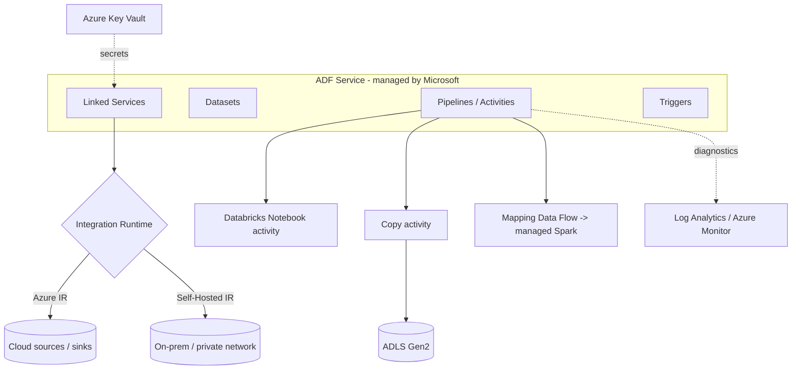
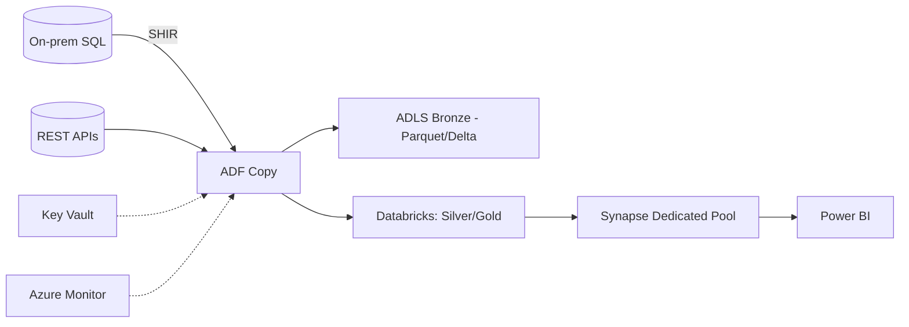

# ADF — Architecture

## Overview
ADF separates **authoring/control** (managed by Microsoft) from **execution** (Integration Runtimes). Knowing this split, plus how ADF interacts with ADLS, Databricks, Synapse, Key Vault, and monitoring, is the "draw the architecture" interview staple.

---

## Components & control flow

- **Control plane (Microsoft-managed):** stores pipeline JSON, schedules triggers, tracks run history. No customer data lives here.
- **Data plane (Integration Runtime):** actually connects to stores and moves/transforms data. Azure IR (managed), Self-Hosted IR (your VM for private/on-prem), Azure-SSIS IR (SSIS lift-and-shift).

---

## How ADF interacts with other Azure services (know each)
| Service | Interaction |
|---|---|
| **ADLS Gen2** | Copy sink/source; authenticated via **Managed Identity** (Storage Blob Data Contributor) |
| **Azure Databricks** | Notebook/Jar/Python activity; pass params via `baseParameters`; job clusters recommended |
| **Azure Synapse** | Copy sink via **COPY/PolyBase** staging; or trigger Synapse pipelines |
| **Key Vault** | Linked service references secrets — no keys in JSON |
| **Azure Monitor / Log Analytics** | Diagnostic settings stream run logs, metrics, alerts |
| **Azure SQL** | Source/sink; MSI auth; stored-proc activity for control tables |

---

## Reference ingestion architecture (memorize)

---

## Quick Revision
- ✔ Control plane (managed) vs data plane (**Integration Runtime**)
- ✔ SHIR = on-prem/private; Azure IR = cloud; SSIS IR = lift SSIS
- ✔ Auth to storage/SQL = **Managed Identity + RBAC**; secrets = **Key Vault**
- ✔ ADF orchestrates; **Databricks transforms**; **Synapse/Power BI serve**
- ✔ Observability = diagnostic settings → **Log Analytics** + alerts

## Common Interview Mistakes
- Thinking customer data flows through the control plane (it doesn't).
- Forgetting SHIR HA (single node = SPOF).
- Not mentioning Key Vault + MSI when drawing security.

## Related Topics
[ADF Interview Questions](ADF%20Interview%20Questions.md) · [ADLS Gen2](../ADLS%20Gen2/) · [Azure Databricks](../Azure%20Databricks/) · [Azure Synapse](../Azure%20Synapse/)
