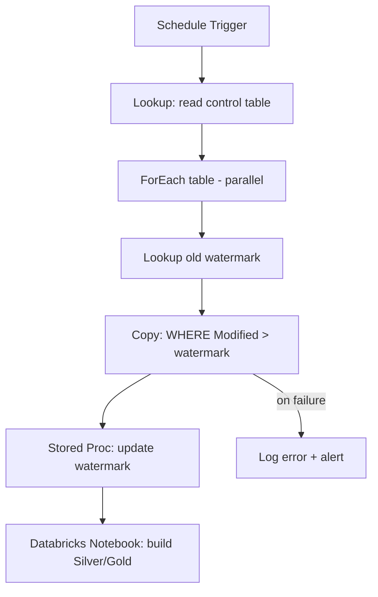

# Azure Data Factory — Interview Questions

## Overview
Azure Data Factory (ADF) is Azure's cloud **ETL/ELT and orchestration** service. You use it to ingest data from 90+ sources, move it into ADLS Gen2, orchestrate transformations (usually in Databricks/Synapse), and schedule/monitor the whole pipeline. In interviews it's tested as the **control plane** of an Azure data platform — orchestration, triggers, IR, parameterization, and cost.

---

## Frequently Asked Interview Questions

| # | Question | Difficulty | Confidence |
|---|---|---|---|
| 1 | What is ADF and where does it fit in an Azure data platform? | 🟢 | ★★★★★ |
| 2 | Pipeline vs Activity vs Dataset vs Linked Service? | 🟢 | ★★★★★ |
| 3 | What is an Integration Runtime (IR)? Types? | 🟡 | ★★★★★ |
| 4 | Azure IR vs Self-Hosted IR vs Azure-SSIS IR — when each? | 🟡 | ★★★★★ |
| 5 | Types of triggers in ADF? | 🟢 | ★★★★★ |
| 6 | Tumbling window vs Schedule trigger? | 🟡 | ★★★★☆ |
| 7 | How do you parameterize pipelines? | 🟡 | ★★★★★ |
| 8 | Copy activity vs Data Flow — when to use which? | 🟡 | ★★★★★ |
| 9 | What are Mapping Data Flows and how do they run? | 🟡 | ★★★★☆ |
| 10 | How do you implement incremental / delta loading? | 🔴 | ★★★★★ |
| 11 | How do you do metadata-driven (config-driven) pipelines? | 🔴 | ★★★★☆ |
| 12 | ForEach + Lookup + parameters pattern? | 🟡 | ★★★★☆ |
| 13 | How do you handle errors / retries / failures? | 🟡 | ★★★★★ |
| 14 | How do you secure ADF (Key Vault, MSI, private endpoints)? | 🔴 | ★★★★★ |
| 15 | How do you do CI/CD for ADF? | 🔴 | ★★★★★ |
| 16 | How do you monitor and alert on pipelines? | 🟡 | ★★★★☆ |
| 17 | How is ADF billed? How do you optimize cost? | 🔴 | ★★★★☆ |
| 18 | How do you call Databricks from ADF? | 🟡 | ★★★★☆ |
| 19 | Get Metadata, Lookup, Filter, Until activities — uses? | 🟡 | ★★★☆☆ |
| 20 | How do you pass data between activities? | 🟡 | ★★★★☆ |
| 21 | ADF vs Synapse Pipelines — difference? | 🟡 | ★★★★☆ |
| 22 | How do you handle schema drift? | 🔴 | ★★★☆☆ |
| 23 | Global parameters vs pipeline parameters vs variables? | 🟡 | ★★★☆☆ |
| 24 | How do you rerun only failed activities? | 🟢 | ★★★☆☆ |
| 25 | Concurrency, throttling, and pipeline limits? | 🔴 | ★★★☆☆ |
| 26 | How to copy 100s of tables efficiently? | 🔴 | ★★★★☆ |
| 27 | When would you NOT use ADF? | 🟡 | ★★★☆☆ |

---

## Detailed Answers (the ones that decide the interview)

### Q1. What is ADF and where does it fit?
**Definition:** A fully managed, serverless data integration service for building ETL/ELT pipelines.
**Why:** It's the orchestration/ingestion layer — connect to sources, move data to the lake, trigger transformations, schedule and monitor.
**Internal working:** ADF authors JSON definitions (pipelines/activities/datasets/linked services); execution happens on an **Integration Runtime**. ADF itself doesn't crunch data for copy — the IR does the movement; heavy transforms are pushed to Spark (Data Flows run on a managed Databricks cluster, or you call Databricks/Synapse directly).
**Real project:** ADF ingests on-prem SQL → ADLS Bronze via Self-Hosted IR nightly, then triggers a Databricks notebook to build Silver/Gold Delta tables, then loads Synapse for Power BI.
**Interview tip:** Always position ADF as **orchestration + ingestion**, and say transformations belong in Databricks for anything non-trivial. That signals senior thinking.

### Q2. Pipeline vs Activity vs Dataset vs Linked Service
- **Linked Service** = connection string / credential to a data store or compute (the "where + how to connect"). *Analogy: the Wi-Fi password.*
- **Dataset** = a named view of the data within that store (a table, a folder of files). *The "which data."*
- **Activity** = a single step (Copy, Lookup, Notebook, Data Flow). *The "what to do."*
- **Pipeline** = a logical group of activities forming a workflow (the DAG).
**Memory trick:** Linked Service → Dataset → Activity → Pipeline = **connection → data → action → workflow**.

### Q3 & Q4. Integration Runtime — types and when
| IR | Runs where | Use for |
|---|---|---|
| **Azure IR** | Managed by Azure (auto-scale) | Cloud-to-cloud copy, Data Flows |
| **Self-Hosted IR (SHIR)** | A VM/machine you install (on-prem or VNet) | On-prem sources, private networks, firewalled data |
| **Azure-SSIS IR** | Managed cluster running SSIS | Lift-and-shift existing SSIS packages |
**Trap:** If a source is **on-premises or behind a private network**, you MUST use a **Self-Hosted IR** — Azure IR can't reach it. Install SHIR on 2+ nodes for high availability.

### Q10. Incremental / delta loading (very commonly asked)
Two industry patterns:
1. **Watermark (high-water-mark) pattern:** store the last-loaded value (e.g., `max(ModifiedDate)`) in a control table. Each run: `Lookup` old watermark → copy rows `WHERE ModifiedDate > @oldWatermark` → `Lookup` new max → update control table. **Atomic-ish, cheap, standard.**
2. **Change Data Capture (CDC) / Change Tracking:** use SQL CDC or the native ADF CDC resource to capture inserts/updates/deletes.
**Real project:** Watermark table `etl.control(TableName, LastLoadedValue)`; a metadata-driven ForEach loops tables, each reading/writing its own watermark.
**Common mistake:** Using `getdate()` as the watermark instead of the source's modified column → misses rows and creates gaps. Always watermark on a **source-side monotonic column**.

### Q11. Metadata-driven pipelines (senior favorite)
Instead of one pipeline per table, build **one generic pipeline** driven by a config/control table (`SourceTable, TargetPath, LoadType, Watermark`). A `Lookup` reads the config, a `ForEach` iterates, and a parameterized `Copy`/notebook runs per row.
**Why:** Onboarding a new table = one row in a table, not a new pipeline. Scales to 100s of tables, one codebase.
**Interview tip:** Say "metadata-driven framework" — it's the single biggest signal of production experience in ADF interviews.

### Q13. Error handling, retries, failures
- **Activity retry** (count + interval) for transient failures.
- **Dependency conditions:** Success / Failure / Completion / Skipped — chain a failure-path activity (e.g., log to a table, send alert).
- **Try-catch pattern:** main activity → on failure → logging activity → optionally raise.
- **Timeouts** per activity; **fault tolerance** on Copy (skip incompatible rows to a log).
**Common mistake:** Leaving default retry = 0, so a one-second network blip fails the whole nightly load.

### Q14. Security (heavily probed for 5+ yr)
- **Never hard-code secrets** → store in **Azure Key Vault**, reference via a Key Vault linked service.
- **Managed Identity (MSI):** ADF's system-assigned identity authenticates to ADLS/SQL/Key Vault via **RBAC** — no keys at all.
- **Private endpoints + Managed VNet** so data never traverses the public internet.
- **RBAC** on the ADF resource (Data Factory Contributor) for who can edit/run.
**Interview trap:** If asked "how do you connect ADF to storage securely?" the strong answer is **Managed Identity + RBAC (Storage Blob Data Contributor)**, not account keys or SAS.

### Q15. CI/CD for ADF
- Author in a **Git-integrated** ADF (collaboration branch, feature branches).
- **Publish** from `main` generates ARM templates into the `adf_publish` branch.
- Azure DevOps/GitHub Actions deploys those ARM templates to Test/Prod, overriding parameters (linked service endpoints, Key Vault URLs) per environment.
- Modern alt: **ADF utilities npm package** for validation/export without the publish branch.
**Common mistake:** Deploying dev linked services to prod. Always parameterize environment-specific values in ARM template parameters.

### Q17. Cost model & optimization
Billed on: **pipeline orchestration** (per activity run), **data movement** (DIU-hours for Copy), **Data Flow** (vCore-hours of the underlying cluster), and **SHIR** (your VM).
Optimize: reduce activity count (metadata-driven), right-size **DIUs** and **parallel copies**, use **staged copy + PolyBase/COPY** for warehouse loads, turn off Data Flow debug sessions, prefer Copy over Data Flow for simple moves, and push transforms to Databricks (cheaper at scale than Data Flows).
**Trap:** Leaving a **Data Flow debug cluster** running racks up cost silently.

---

## Scenario Questions

**S1. "Your ADF pipeline copying 300 tables takes 8 hours. Optimize it."**
- Check the pattern: is it sequential? Set **ForEach `isSequential=false`** and tune `batchCount` (parallelism).
- Increase **parallel copies** and **DIUs** on the Copy activity for large tables.
- Move to **incremental** loads (watermark) so you copy deltas, not full tables.
- For the warehouse sink, use **staged copy + COPY/PolyBase** instead of row-by-row insert.
- Split large tables by **partition** (Copy source partitioning) to parallelize within a table.
- Separate small vs huge tables into different concurrency lanes.
- Check the **SHIR** isn't the bottleneck (CPU/network) — scale out to multiple nodes.

**S2. "On-prem SQL Server must load to ADLS nightly, firewalled network. Design it."**
- **Self-Hosted IR** on an on-prem VM (2 nodes for HA) → Copy activity → ADLS Gen2 (Parquet).
- Credentials in **Key Vault**; incremental via **watermark**; **schedule trigger** nightly; **alert** on failure via Azure Monitor.

**S3. "A pipeline randomly fails ~10% of runs at night. How do you debug?"**
- Open **Monitor → failed run**, drill to the failing activity's error; check IR health, throttling (429), and source availability windows.
- Add **retries with interval**; check if a backup/maintenance job locks the source at that time.
- Add logging activity to persist error details to a table for pattern analysis.

**S4. "Onboard 50 new tables with minimal effort."**
- Add 50 rows to the **control table**; the existing **metadata-driven** pipeline picks them up. No new pipelines.

**S5. "Same pipeline must run in Dev, Test, Prod with different endpoints."**
- **Global/pipeline parameters** + **ARM template parameterization**; per-environment values injected at deploy time via the release pipeline.

---

## Hands-on Questions
- How would you **create** an incremental copy pipeline? (Lookup watermark → Copy with dynamic query → update watermark.)
- How would you **debug** a slow Copy activity? (Check DIU, parallelism, source partitioning, staging, IR metrics.)
- How would you **migrate** SSIS packages to Azure? (Azure-SSIS IR lift-and-shift, then modernize to native activities/Databricks.)
- How would you **call** a Databricks notebook and pass parameters? (Databricks Notebook activity + `baseParameters`.)
- How would you **parameterize** a dataset's file path by date? (`@formatDateTime(pipeline().TriggerTime,'yyyy/MM/dd')`.)

---

## Code Examples

**Dynamic incremental query (Copy source):**
```sql
SELECT * FROM dbo.Orders
WHERE ModifiedDate > '@{activity('LookupOldWatermark').output.firstRow.LastLoadedValue}'
```

**ADF expression — date-partitioned folder path:**
```
@concat('bronze/orders/', formatDateTime(pipeline().TriggerTime, 'yyyy/MM/dd'), '/')
```

**ForEach over Lookup output (parallel):**
```
Items:  @activity('LookupTables').output.value
isSequential: false
batchCount: 10
```

**Databricks Notebook activity parameters:**
```json
"baseParameters": {
  "run_date": "@pipeline().parameters.run_date",
  "table": "@item().SourceTable"
}
```

---

## Diagram



---

## Quick Revision
- ✔ **Building blocks:** Linked Service → Dataset → Activity → Pipeline
- ✔ **IR types:** Azure (cloud) · Self-Hosted (on-prem/private) · Azure-SSIS (lift SSIS)
- ✔ **Triggers:** Schedule · Tumbling Window (has state/backfill) · Storage Event · Manual
- ✔ **Incremental = watermark table** on a source modified column
- ✔ **Metadata-driven** = one generic pipeline + control table (senior signal)
- ✔ **Security = Managed Identity + Key Vault + RBAC + private endpoints**
- ✔ **CI/CD = Git → publish ARM → DevOps release with per-env params**
- ✔ **Copy for movement, Databricks for transformation**

---

## Common Interview Mistakes
- Saying ADF "transforms data" — it **orchestrates**; heavy transforms go to Spark.
- Using account keys/SAS instead of **Managed Identity**.
- Full loads when incremental is expected.
- Not knowing **Self-Hosted IR** is required for on-prem.
- Confusing **Tumbling Window** (stateful, supports backfill/dependencies) with **Schedule** (fire-and-forget).
- Forgetting cost drivers (activity runs, DIUs, Data Flow vCores).

---

## Senior-Level Discussion (5+ yr)
A senior answer frames ADF as one layer in a governed platform: **metadata-driven ingestion framework**, **Key Vault + MSI** security, **incremental with watermark/CDC**, **CI/CD via ARM + DevOps**, **observability via Azure Monitor/Log Analytics with alerts**, and a clear **cost model**. They'll proactively mention *when NOT to use ADF* (real-time streaming → Event Hub/Stream Analytics; complex code transforms → Databricks; sub-minute latency → not ADF) and discuss **idempotency, restartability, and partition-parallel copy** for large migrations.

---

## Follow-up Questions (interviewers love these)
- "How do you make the pipeline **idempotent** so a rerun doesn't duplicate data?" → overwrite partition / MERGE on key / delete-insert by watermark window.
- "How do you handle **late-arriving data**?" → reprocess by partition window; tumbling window with lateness.
- "What if the **watermark update fails** after copy succeeds?" → next run re-copies overlap; use MERGE for idempotency.
- "How do you deploy **without downtime**?" → deploy to prod ARF via ARM, triggers stopped/started around deployment.

---

## Related Topics
[ADLS Gen2](../ADLS%20Gen2/) · [Azure Databricks](../Azure%20Databricks/) · [Azure Synapse](../Azure%20Synapse/) · [CI-CD](../CI-CD/) · [ETL vs ELT](../ETL%20vs%20ELT/) · [Scenario Based Questions](../Scenario%20Based%20Questions/)
