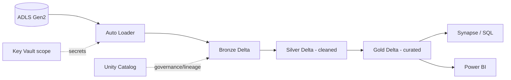

# Azure Databricks — Interview Questions

## Overview
Azure Databricks is a managed **Apache Spark + Delta Lake** platform — the primary compute for large-scale transformation in Azure data platforms. Interviews probe Spark internals, Delta, cluster/cost design, Unity Catalog governance, and how Databricks plugs into ADF/ADLS/Synapse.

---

## Frequently Asked Interview Questions

| # | Question | Difficulty | Confidence |
|---|---|---|---|
| 1 | What is Azure Databricks and why over open-source Spark? | 🟢 | ★★★★★ |
| 2 | Control plane vs data/compute plane in Databricks? | 🟡 | ★★★★☆ |
| 3 | All-purpose vs Job cluster? | 🟢 | ★★★★★ |
| 4 | Cluster sizing — how do you decide? | 🔴 | ★★★★☆ |
| 5 | What is the Databricks Runtime? Photon? | 🟡 | ★★★★☆ |
| 6 | How do you mount/access ADLS Gen2 securely? | 🔴 | ★★★★★ |
| 7 | What is Unity Catalog? Object hierarchy? | 🟡 | ★★★★★ |
| 8 | Managed vs external tables? | 🟡 | ★★★★★ |
| 9 | `%run` vs `dbutils.notebook.run()`? | 🟡 | ★★★★☆ |
| 10 | How do you pass parameters to a notebook (widgets)? | 🟢 | ★★★★☆ |
| 11 | What is Delta Lake and why default? | 🟢 | ★★★★★ |
| 12 | How do you orchestrate Databricks (Jobs/Workflows)? | 🟡 | ★★★★☆ |
| 13 | How does ADF call Databricks? | 🟡 | ★★★★☆ |
| 14 | Autoscaling & auto-termination — why? | 🟢 | ★★★★☆ |
| 15 | How do you manage secrets in Databricks? | 🟡 | ★★★★★ |
| 16 | What is Auto Loader? | 🟡 | ★★★★☆ |
| 17 | What are Delta Live Tables (DLT)? | 🟡 | ★★★☆☆ |
| 18 | Job cluster vs all-purpose for production — why? | 🟡 | ★★★★☆ |
| 19 | How do you optimize a slow Databricks job? | 🔴 | ★★★★★ |
| 20 | How do you do CI/CD for Databricks? | 🔴 | ★★★★☆ |
| 21 | How do you monitor jobs & clusters? | 🟡 | ★★★☆☆ |
| 22 | Repos/Git integration? | 🟢 | ★★★☆☆ |
| 23 | Photon — when does it help / not? | 🟡 | ★★★☆☆ |
| 24 | How is Databricks billed (DBU)? Cost optimization? | 🔴 | ★★★★☆ |
| 25 | When would you NOT use Databricks? | 🟡 | ★★★☆☆ |

---

## Detailed Answers

### Q1. Why Azure Databricks over OSS Spark?
Managed clusters (no infra), **optimized runtime + Photon** (faster/cheaper), **Delta Lake** built-in, **Unity Catalog** governance, notebooks + collaboration, native **ADLS/ADF/Synapse/Key Vault** integration, and autoscaling. You focus on data, not on running Spark.

### Q2. Control plane vs compute plane
- **Control plane** (Databricks-managed): workspace UI, notebooks, job scheduler, cluster manager.
- **Compute/data plane** (in **your** Azure subscription's VNet for classic): the clusters that read your ADLS data in place.
**Trap:** Your data stays in **your ADLS** — Databricks reads it; data doesn't move into Databricks' account.

### Q6. Access ADLS Gen2 securely (top question)
Best → worst:
1. **Unity Catalog external locations + storage credentials (Managed Identity / Access Connector)** — governed, no secrets. *Preferred today.*
2. **Service Principal + OAuth**, secret stored in **Key Vault-backed secret scope**.
3. Mounts with SP (legacy).
4. ❌ **Storage account keys** — avoid.
**Real project:** Databricks Access Connector (managed identity) granted `Storage Blob Data Contributor` on the ADLS container; UC external location points to it. No keys anywhere.

### Q8. Managed vs external tables
- **Managed:** Databricks/UC owns the storage path; `DROP TABLE` deletes data + metadata.
- **External:** you specify `LOCATION`; `DROP` removes only metadata, **data stays**.
**Trap:** Use external for data you share with other engines or must retain after drop.

### Q9. `%run` vs `dbutils.notebook.run()`
- `%run ./utils` = runs inline, **shares variables/functions**. Use for shared config/functions.
- `dbutils.notebook.run("nb", timeout, args)` = runs as a **separate** execution, returns a **string** only. Use for orchestration/parameterization.

### Q19. Optimize a slow Databricks job (must-know)
Systematic checklist:
- **Spill/skew?** Check Spark UI stages — long tasks = skew. Fix with salting, AQE skew join, or broadcast.
- **Shuffle-heavy?** Reduce wide transforms; **broadcast** small dimension (`broadcast(df)` or `spark.sql.autoBroadcastJoinThreshold`).
- **Small files?** `OPTIMIZE` + right file sizes; use Auto Loader; avoid tiny writes.
- **Reading too much?** **Partition pruning** + `ZORDER` on filter columns; column pruning; predicate pushdown.
- **Under-parallelized?** Tune `spark.sql.shuffle.partitions` to cluster cores; enable **AQE**.
- **Caching** re-used DataFrames; **Photon** for SQL-heavy work.
- **Cluster** right-sized; enough executors; avoid `collect()`.
**Interview tip:** Always say "I'd read the **Spark UI** first" — data-driven tuning beats guessing.

### Q24. DBU billing & cost
Billed in **DBUs** (Databricks Units) × cluster type/runtime × time, **plus** the underlying Azure VMs. Optimize:
- **Job clusters** (auto-terminate) for prod, not all-purpose.
- **Autoscaling** + **auto-termination** on idle.
- **Spot/low-priority** VMs for non-critical.
- **Photon** to finish faster (fewer VM-hours).
- Right-size; avoid oversized always-on clusters; use **pools** to cut startup cost.

### Q25. When NOT to use Databricks
- Tiny data that fits in a single node / pandas (Spark overhead not worth it).
- Simple copy/movement (use ADF Copy).
- Sub-second OLTP / point lookups (use Azure SQL/Cosmos).
- Pure BI serving (use Synapse/SQL).

---

## Scenario Questions

**S1. "Databricks job that took 1 hr now takes 4 hrs after data grew. Diagnose."**
Spark UI → find the slow stage. Likely **data skew** (one key dominates) or **small-file explosion** or **spill**. Fixes: AQE skew handling / salting, `OPTIMIZE`+`ZORDER`, increase shuffle partitions, broadcast small side, right-size cluster. Check if a full scan replaced partition pruning.

**S2. "Costs doubled. Reduce without hurting SLAs."**
Move prod to **job clusters** with auto-terminate; enable autoscaling; **spot** for dev; **Photon** to shorten runtime; kill idle all-purpose clusters; use **pools**; consolidate tiny jobs.

**S3. "Ingest millions of small JSON files landing continuously."**
**Auto Loader** (`cloudFiles`) → Bronze Delta (incremental, schema evolution, checkpointed), then stream Bronze→Silver→Gold. Don't `spark.read` the whole folder each run.

**S4. "Multiple teams need governed, audited access to the same tables."**
**Unity Catalog**: three-level namespace, GRANT to **groups**, automatic **lineage** and audit, external locations via managed identity. Row/column security via dynamic views.

**S5. "Notebook works interactively but fails in the scheduled job."**
Usually: missing **widget parameters**, different cluster libraries, hard-coded paths, or permissions (job runs as a different identity). Parameterize, pin libraries, use secret scopes, check the run-as identity's RBAC.

---

## Hands-on Questions
- How would you **create** a job cluster and schedule a notebook? (Workflows → task → job cluster + cron.)
- How would you **debug** skew? (Spark UI stage → task duration histogram → salt/broadcast.)
- How would you **migrate** a Hive/Parquet table to Delta? (`CONVERT TO DELTA`.)
- How would you **secure** ADLS access? (UC storage credential / SP + secret scope, never keys.)
- How would you **optimize** a Delta table? (`OPTIMIZE ... ZORDER BY`, `VACUUM`, right file sizes.)

---

## Code Examples

**Read secret from a scope (never hard-code):**
```python
key = dbutils.secrets.get(scope="kv-scope", key="adls-sp-secret")
```

**Widgets (job parameters):**
```python
dbutils.widgets.text("run_date", "2026-01-01")
run_date = dbutils.widgets.get("run_date")
```

**Broadcast join to kill a shuffle:**
```python
from pyspark.sql.functions import broadcast
result = fact.join(broadcast(dim), "dim_id")
```

**Auto Loader → Bronze:**
```python
(spark.readStream.format("cloudFiles")
   .option("cloudFiles.format","json")
   .option("cloudFiles.schemaLocation","/chk/schema")
   .load("/mnt/landing/")
 .writeStream.option("checkpointLocation","/chk/bronze")
   .trigger(availableNow=True).table("bronze.events"))
```

**Delta maintenance:**
```sql
OPTIMIZE sales.orders ZORDER BY (customer_id);
VACUUM sales.orders RETAIN 168 HOURS;
```

---

## Diagram



---

## Quick Revision
- ✔ Databricks = managed **Spark + Delta + Photon + Unity Catalog**
- ✔ **Job cluster** (auto-terminate) for prod; all-purpose for dev
- ✔ **ADLS access = Unity Catalog / SP + secret scope**, never keys
- ✔ Optimize = read **Spark UI** → fix skew/shuffle/small-files → OPTIMIZE/ZORDER/broadcast/AQE
- ✔ **Auto Loader** for incremental file ingestion
- ✔ Cost = DBU × VM time → job clusters + autoscale + Photon + spot
- ✔ `%run` shares vars; `dbutils.notebook.run()` separate + returns string

---

## Common Interview Mistakes
- Using **storage keys** for ADLS instead of managed identity/SP.
- Running prod on **all-purpose** clusters (costly).
- "Just add more nodes" for skew — wrong; fix the skew.
- Calling `collect()` on big data (driver OOM).
- Not mentioning **Spark UI** when asked to optimize.

---

## Senior-Level Discussion (5+ yr)
Senior answers connect Databricks to the **whole platform**: medallion architecture on Delta, **Unity Catalog** governance (lineage/audit/RBAC), **job-cluster cost discipline**, **CI/CD** (Repos + DABs/Asset Bundles + DevOps), **observability** (job alerts, cluster logs to Log Analytics), and **performance methodology** (Spark UI → skew/shuffle/AQE/Photon). They know DBU economics and *when Spark is overkill*.

---

## Follow-up Questions
- "How does **AQE** help?" → runtime re-optimization: coalesce shuffle partitions, skew join handling, dynamic join switch.
- "Photon limitations?" → helps SQL/Delta scans; less benefit for heavy Python UDFs/RDD code.
- "How do you guarantee **exactly-once** streaming?" → checkpoint + idempotent Delta sink.
- "Cluster pool purpose?" → pre-warmed VMs to cut cluster start latency/cost.

---

## Related Topics
[PySpark](../PySpark/) · [Delta Lake](../Delta%20Lake/) · [Spark Architecture](Spark%20Architecture.md) · [Performance Optimization](Performance%20Optimization.md) · [ADLS Gen2](../ADLS%20Gen2/) · [Azure Data Factory](../Azure%20Data%20Factory/)
