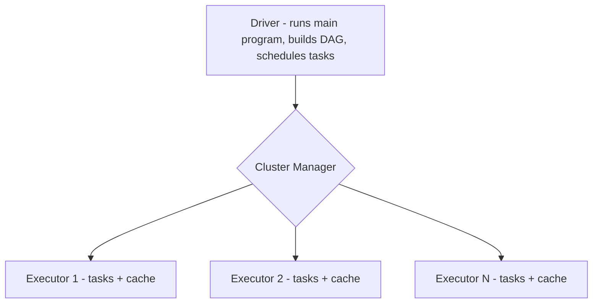
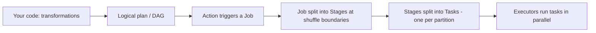

# Spark Architecture

## Overview
Apache Spark is a distributed, in-memory processing engine. A **driver** coordinates and **executors** do the parallel work across a cluster. Understanding the driver/executor model, jobs→stages→tasks, lazy evaluation, and shuffles is the backbone of every Databricks/PySpark performance question.

---

## Core components

- **Driver:** one per app. Builds the logical plan, creates the **DAG**, splits into stages/tasks, schedules them, collects results. `collect()`/`display()` return here (careful — driver memory).
- **Executors:** JVM processes on worker nodes running **tasks** in parallel; hold cached data and shuffle files.
- **Cluster Manager:** allocates executors (in Databricks, managed for you).

---

## Execution flow (know this cold)

1. **Transformations are lazy** (`select`, `filter`, `join`) — build the plan, run nothing.
2. An **action** (`count`, `write`, `collect`, `show`) triggers a **Job**.
3. Catalyst optimizer builds the plan → **Jobs → Stages → Tasks**.
4. **Stage boundary = shuffle** (wide transformation).
5. **1 task per partition** runs on executors.

---

## Narrow vs wide transformations
| | Narrow | Wide |
|---|---|---|
| Data movement | Within partition, **no shuffle** | **Shuffle** across cluster |
| Examples | `select`, `filter`, `withColumn`, `map` | `groupBy`, `join`, `distinct`, `orderBy`, `repartition` |
| Cost | Cheap | Expensive (network + disk) |

**Memory trick:** Narrow = stays home. Wide = travels (shuffle).

---

## Key concepts interviewers probe
- **Lazy evaluation:** lets Catalyst optimize the whole plan before running.
- **DAG:** the dependency graph of RDD/DataFrame operations.
- **Catalyst optimizer:** rule + cost-based query optimization.
- **Tungsten:** memory/CPU-efficient execution (binary format, code gen).
- **AQE (Adaptive Query Execution):** re-optimizes at runtime — coalesces shuffle partitions, handles skew joins, switches join strategies.
- **Shuffle:** redistributes data by key; the #1 performance cost.
- **Partitions:** unit of parallelism; too few = under-parallelized, too many = overhead/small files.

---

## Quick Revision
- ✔ **Driver** (1, coordinates) + **Executors** (N, parallel tasks)
- ✔ **Transformations lazy**, **actions** trigger execution
- ✔ Job → Stages (split at **shuffle**) → Tasks (**1 per partition**)
- ✔ Narrow (no shuffle) vs Wide (shuffle)
- ✔ **AQE** + **Catalyst** + **Tungsten** = Spark's speed
- ✔ Shuffle is the main cost → minimize wide ops, broadcast small tables

## Common Interview Mistakes
- Saying transformations execute immediately (they're lazy).
- Confusing stage boundaries — they're at **shuffles**.
- `collect()` on large data → driver OOM.
- Not knowing tasks map to **partitions**.

## Senior-Level Discussion
Senior candidates reason from the **Spark UI**: identify the expensive stage, see if it's shuffle/skew/spill bound, then choose the right lever (broadcast, AQE, repartition, salting, cache, Photon). They tie partition count to cluster cores and file sizes.

## Related Topics
[PySpark](../PySpark/) · [Performance Optimization](Performance%20Optimization.md) · [Transformations vs Actions](../PySpark/Transformations%20vs%20Actions.md) · [Partitioning](../PySpark/Partitioning.md)
