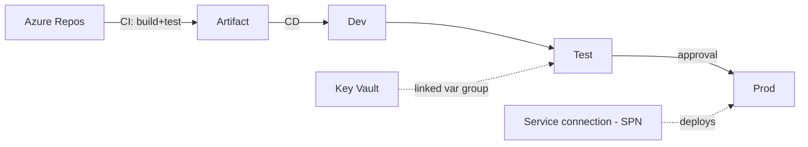

# Azure DevOps — Interview Questions & Answers

## Overview
Azure DevOps provides Repos, Pipelines, Boards, and Artifacts to build/test/deploy data solutions. For a DE the focus is **Pipelines (YAML)**, release stages, variable groups, and service connections to Azure.

Difficulty: 🟢 · 🟡 · 🔴 · Confidence: ★.

---

## Interview Questions & Answers

### 🟢 Q1. Azure DevOps components? ★★★★☆
**Repos** (Git), **Pipelines** (CI/CD), **Boards** (work tracking), **Artifacts** (package feeds), **Test Plans**. For DE you mostly use Repos + Pipelines (+ variable groups linked to Key Vault).

### 🟡 Q2. Build (CI) vs Release (CD) pipeline? ★★★★★
**Build/CI** compiles, runs tests, and produces artifacts on each commit. **Release/CD** takes those artifacts and deploys them to environments (Dev/Test/Prod) with approvals. In YAML both can be one multi-stage pipeline.

### 🟡 Q3. YAML vs classic pipelines? ★★★☆☆
**YAML** pipelines are code in the repo (versioned, reviewable, reusable via templates) — the modern default. **Classic** are UI-configured (no version control). Prefer YAML.

### 🟡 Q4. Variable groups & Key Vault linking? ★★★★★
**Variable groups** store shared config values reused across pipelines. Link a group to **Azure Key Vault** so secrets are pulled securely at runtime — never stored in YAML or logs.

### 🔴 Q5. Service connections / service principals? ★★★★☆
A **service connection** lets the pipeline authenticate to Azure using a **service principal** (or workload identity federation) with **scoped RBAC**. It's how pipelines deploy to resource groups securely without personal credentials.

### 🟡 Q6. Multi-stage pipeline (dev/test/prod)? ★★★★☆
One YAML with sequential **stages**, each deploying to an environment, with **per-stage variable groups** and **approvals** between stages. Promotes the same artifact through environments.

### 🟡 Q7. Approvals & gates? ★★★☆☆
**Approvals** = required human sign-off before a stage runs. **Gates** = automated pre/post-deployment checks (e.g., query a health API, no active incidents). Both protect production.

### 🟡 Q8. Self-hosted vs Microsoft-hosted agents? ★★★☆☆
**Microsoft-hosted** = managed, ephemeral VMs (no maintenance, but can't reach private networks). **Self-hosted** = your VM/agent (needed to reach **private/VNet resources** or use custom tooling).

### 🔴 Q9. How do you deploy ADF/Databricks from DevOps? ★★★★☆
**ADF**: an ARM template deployment task deploys the `adf_publish` output with per-env parameter overrides. **Databricks**: CLI / Asset Bundles / `dbx` tasks deploy notebooks + jobs; secrets via Key Vault-linked groups.

### 🟡 Q10. Pipeline templates — why? ★★★☆☆
Reusable YAML templates (steps/stages) shared across projects reduce duplication and enforce standards (same build/test/deploy pattern everywhere).

### 🟡 Q11. Artifacts & feeds? ★★★☆☆
**Azure Artifacts** hosts package feeds (Python wheels, NuGet, Maven) so builds publish and consume versioned internal packages reproducibly.

### 🟡 Q12. How do you keep prod secure? ★★★★☆
Least-privilege **service connections**, **Key Vault-linked** variable groups, **approval gates** on prod, environment protection rules, and secret scanning — no secrets in YAML.

---

## Scenario Questions
**🔴 S1. "Deploy to 3 environments with approvals." ★★★★★** → multi-stage YAML: dev (auto) → test (auto) → prod (**manual approval gate**), per-stage variable groups.
**🟡 S2. "Pipeline must reach a private resource." ★★★★☆** → use a **self-hosted agent** in the VNet.
**🟡 S3. "Keep prod secrets safe." ★★★★☆** → Key Vault-linked variable group + scoped service connection; no secrets in YAML.
**🟡 S4. "Reduce duplicated pipeline YAML." ★★★☆☆** → shared **pipeline templates**.

---

## Diagram

---

## Quick Revision
- ✔ Repos · Pipelines · Boards · Artifacts
- ✔ CI (build+test) vs CD (release with approvals); prefer **YAML**
- ✔ **Variable groups linked to Key Vault** for secrets
- ✔ **Service connection = service principal** with scoped RBAC
- ✔ Self-hosted agents for private networks
- ✔ Multi-stage + **approval gates** for prod; templates for reuse

## Common Interview Mistakes
- Secrets in YAML instead of Key Vault-linked groups.
- Over-privileged service principals.
- No prod approval gate.
- Microsoft-hosted agents for private-network deploys.

## Senior-Level Discussion
Seniors design least-privilege service connections, Key Vault-backed variable groups, multi-stage pipelines with gates/approvals, and reusable YAML templates — integrating ADF/Databricks/IaC deploys and environment protection.

## Follow-up Questions
- "Why link variable groups to Key Vault?" → central rotation + no secrets in pipeline definitions.
- "When do you need a self-hosted agent?" → private VNet resources, custom software, or licensing.

## Related Topics
CI-CD, Git, Terraform, ARM Templates, Azure Data Factory
