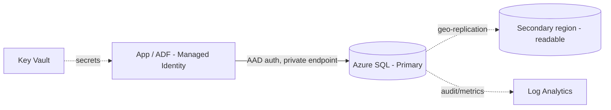

# Azure SQL Database — Interview Questions & Answers

## Overview
Azure SQL Database is a managed PaaS relational database (OLTP) used for control/metadata tables, small serving marts, and application data in an Azure DE platform. Interviews cover deployment options, DTU vs vCore, HA/geo-replication, security (MSI/Key Vault), and performance.

Difficulty: 🟢 Easy · 🟡 Medium · 🔴 Hard · Confidence: ★ = how often asked.

---

## Interview Questions & Answers

### 🟡 Q1. Azure SQL DB vs Managed Instance vs SQL on VM? ★★★★★
- **SQL Database** = single managed database, most PaaS features (auto-patching, backups, HA), least admin. Best for new cloud apps.
- **Managed Instance** = near-100% SQL Server compatibility (SQL Agent, cross-DB queries, CLR, linked servers) for **lift-and-shift** of on-prem SQL Server.
- **SQL on VM (IaaS)** = full control, you patch/manage the OS and SQL — use only when you need OS-level control or an unsupported feature.

### 🟡 Q2. DTU vs vCore purchasing models? ★★★★☆
- **DTU** = a bundled blend of compute+memory+IO (simple, fixed ratios). Good for predictable small workloads.
- **vCore** = choose cores and memory independently; supports **Hyperscale** and **Serverless**, Azure Hybrid Benefit (reuse licenses), and better cost transparency. Preferred for most workloads.

### 🟡 Q3. Elastic pools — what and why? ★★★☆☆
A shared pool of compute (DTUs/vCores) across many databases with **variable, non-overlapping** usage. Databases borrow capacity as needed — cheaper than provisioning each DB at peak. Ideal for SaaS multi-tenant (one DB per tenant).

### 🔴 Q4. HA & geo-replication / failover groups? ★★★★☆
Built-in HA keeps 3–4 replicas within a region (99.99% SLA). For cross-region DR use **active geo-replication** (readable secondaries) or **auto-failover groups** (group of DBs + automatic failover + a stable listener endpoint). Business Critical tier adds an in-region always-on replica.

### 🟡 Q5. Backup & point-in-time restore (PITR)? ★★★★☆
Automatic backups (full/diff/log) enable **PITR** within the retention window (default 7 days, up to 35). **Long-term retention (LTR)** keeps weekly/monthly/yearly backups for years. Restores create a **new** database (you don't overwrite in place).

### 🔴 Q6. How do you secure Azure SQL? ★★★★★
- **Microsoft Entra (AAD) auth + Managed Identity** for apps/ADF (no SQL logins/passwords).
- **Firewall + private endpoint** (deny public access).
- **TDE** (encryption at rest, on by default); **Always Encrypted** for sensitive columns (encrypted even from DBAs).
- Secrets in **Key Vault**; **auditing + Microsoft Defender for SQL** to Log Analytics; **row-level security** and **dynamic data masking** for fine-grained control.

### 🔴 Q7. Indexing & performance tuning? ★★★★☆
Index columns used in WHERE/JOIN/ORDER BY; use **covering indexes** (INCLUDE) to avoid key lookups; keep **statistics** current; write **SARGable** predicates (no functions on indexed columns); read the **execution plan**; use **Query Store** and **automatic tuning** (Azure suggests/creates indexes and fixes plan regressions).

### 🟡 Q8. Where does Azure SQL fit in a DE pipeline? ★★★★☆
Typically hosts **ETL control/watermark tables**, config/metadata, and small curated **serving marts** feeding Power BI — **not** the big analytical store (that's Synapse/Databricks). It's OLTP-shaped; keep heavy analytics off it.

### 🟡 Q9. Serverless compute tier? ★★★☆☆
Auto-scales compute within a min/max vCore range and **auto-pauses** when idle (you pay only for storage while paused). Great for intermittent/dev workloads; trade-off is a small resume latency (cold start).

### 🟡 Q10. Connection pooling / throttling? ★★★☆☆
Azure SQL enforces limits by tier (max concurrent sessions/workers). Use **connection pooling** in the app to reuse connections; handle transient errors with **retry logic** (SqlClient has built-in retry). Throttling (error 10928/10929) means you've hit resource limits — scale up or optimize.

### 🟡 Q11. Hyperscale tier — when? ★★★☆☆
For very large databases (up to 100 TB) needing fast backups/restores and rapid read-scale-out. Separates compute from a distributed storage layer. Use when a single DB outgrows General Purpose limits.

### 🟡 Q12. Read replicas / read scale-out? ★★★☆☆
Business Critical and Hyperscale offer **read-only replicas**; route reporting queries with `ApplicationIntent=ReadOnly` to offload the primary.

---

## Scenario Questions
**🔴 S1. "App DB needs 99.99%+ uptime across regions." ★★★★☆** → **Auto-failover group** with geo-replication; app uses the failover-group listener so failover is transparent.
**🔴 S2. "Secure for a compliance audit." ★★★★★** → AAD auth + MSI, private endpoint, TDE, Always Encrypted for PII, auditing + Defender to Log Analytics, RLS/masking.
**🟡 S3. "Many small tenant DBs, cost is high." ★★★★☆** → **Elastic pool** to share compute across DBs.
**🟡 S4. "Reporting slows the transactional app." ★★★☆☆** → route reports to a **read replica** (`ApplicationIntent=ReadOnly`) or offload to a mart/Synapse.
**🟡 S5. "Accidental bad update 2 hours ago." ★★★★☆** → **PITR** to a new DB at the timestamp, reconcile, then swap.

---

## Hands-on Questions
- **Create** an auto-failover group across two regions.
- **Configure** AAD-only auth + a managed identity for ADF.
- **Debug** a slow query with Query Store + execution plan.
- **Restore** to a point in time.
- **Set up** private endpoint + firewall to block public access.

---

## Code Examples
```sql
-- Row-level security predicate
CREATE FUNCTION dbo.fn_region(@region NVARCHAR(50)) RETURNS TABLE
WITH SCHEMABINDING AS RETURN
  SELECT 1 AS ok WHERE @region = USER_NAME() OR IS_ROLEMEMBER('admin') = 1;

-- SARGable vs non-SARGable
WHERE order_date >= '2026-01-01' AND order_date < '2027-01-01'   -- SARGable (index seek)
-- not: WHERE YEAR(order_date) = 2026                             -- scan
```
```bash
# Connect via managed identity (no password) - conceptual connection string
Server=tcp:srv.database.windows.net;Database=db;Authentication=Active Directory Managed Identity;
```

---

## Diagram


---

## Quick Revision
- ✔ SQL DB (PaaS) · Managed Instance (compat/lift-shift) · SQL on VM (IaaS)
- ✔ **vCore** (flexible, Hyperscale, Serverless) vs **DTU** (bundled)
- ✔ Security = **AAD + Managed Identity + private endpoint + TDE + Key Vault**
- ✔ HA = failover groups + geo-replication; **PITR** + LTR backups
- ✔ Elastic pool = share compute across many DBs
- ✔ In DE: control/watermark tables + small marts (not big analytics)
- ✔ Tune: index WHERE/JOIN/ORDER BY, SARGable, Query Store, stats

## Common Interview Mistakes
- SQL logins instead of AAD/MSI.
- Using Azure SQL as the big analytics warehouse (use Synapse/Databricks).
- Non-SARGable predicates; missing/stale statistics.
- Forgetting to configure backup retention / geo-DR.

## Senior-Level Discussion
Seniors choose the deployment model by compatibility/cost, design HA/DR (failover groups), enforce **AAD + MSI + private endpoints + TDE/Always Encrypted**, use Hyperscale/Serverless where they fit, and keep heavy analytics off OLTP — offloading to Synapse/Databricks.

## Follow-up Questions
- "Why failover groups over plain geo-replication?" → stable listener endpoint + automatic failover of a group of DBs.
- "Always Encrypted vs TDE?" → TDE = at rest (server can decrypt); Always Encrypted = data encrypted client-side, hidden even from DBAs.
- "Serverless cold start impact?" → first query after auto-pause has resume latency.

## Related Topics
SQL, Azure Synapse, Azure Data Factory, Data Warehousing
