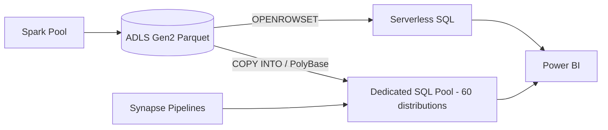

# Azure Synapse Analytics — Interview Questions

## Overview
Synapse is Azure's unified analytics platform: **Dedicated SQL Pools** (MPP data warehouse), **Serverless SQL** (query files in the lake), **Spark pools**, and **Pipelines** (ADF engine). Interviews focus on MPP distribution, dedicated vs serverless, avoiding data movement, and warehouse performance.

---

## Frequently Asked Interview Questions

| # | Question | Difficulty | Confidence |
|---|---|---|---|
| 1 | What is Synapse? Its components? | 🟢 | ★★★★★ |
| 2 | Dedicated vs Serverless SQL Pool? | 🟡 | ★★★★★ |
| 3 | What is MPP architecture? | 🟡 | ★★★★★ |
| 4 | Distribution: HASH / ROUND_ROBIN / REPLICATE? | 🔴 | ★★★★★ |
| 5 | What is data movement (shuffle)? Avoid it? | 🔴 | ★★★★★ |
| 6 | PolyBase / COPY INTO for loading? | 🟡 | ★★★★☆ |
| 7 | Clustered columnstore index? | 🟡 | ★★★★☆ |
| 8 | Partitioning in Synapse? | 🟡 | ★★★☆☆ |
| 9 | Resource classes / workload management? | 🔴 | ★★★☆☆ |
| 10 | Synapse vs Databricks vs Snowflake? | 🟡 | ★★★★☆ |
| 11 | How to optimize a slow Synapse query? | 🔴 | ★★★★☆ |
| 12 | Statistics — why they matter? | 🟡 | ★★★☆☆ |
| 13 | What are the 60 distributions? | 🟡 | ★★★☆☆ |
| 14 | Pause/resume & cost (DWU)? | 🟡 | ★★★★☆ |
| 15 | CTAS vs INSERT for loading? | 🟡 | ★★★☆☆ |
| 16 | Serverless external tables / OPENROWSET? | 🟡 | ★★★☆☆ |
| 17 | Materialized views & result-set caching? | 🟡 | ★★★☆☆ |
| 18 | How does Synapse integrate with ADLS/ADF/Power BI? | 🟡 | ★★★★☆ |
| 19 | Round-robin vs hash for staging? | 🟡 | ★★★☆☆ |
| 20 | When would you NOT use dedicated pool? | 🟡 | ★★★☆☆ |

---

## Detailed Answers

### Q2. Dedicated vs Serverless
**Dedicated** = provisioned MPP warehouse (billed by **DWU**), for high-concurrency curated serving; **pause when idle**. **Serverless** = pay-per-TB-scanned, query Parquet/CSV/Delta directly in ADLS via `OPENROWSET`/external tables, no infra — great for ad-hoc/lake exploration. Trap: serverless can't *store* data; dedicated costs even idle unless paused.

### Q3/Q13. MPP & 60 distributions
Dedicated pool spreads data across **60 distributions**; queries run in parallel across them. The **distribution column** decides which rows land where — the single biggest performance lever.

### Q4. Distribution types (must-know)
| Type | Use | Why |
|---|---|---|
| **HASH** | Large fact tables (on the join key) | Co-locates matching rows → no shuffle on joins |
| **REPLICATE** | Small dimensions (<~2GB) | Full copy on every distribution → no movement |
| **ROUND_ROBIN** | Staging / no clear key | Even spread, fast load, but joins shuffle |

### Q5. Data movement
Redistributing rows across distributions to satisfy a join/aggregation — the #1 Synapse perf killer. Avoid by **aligning HASH distribution keys on join columns** and **REPLICATE**-ing small dims. Check the query plan for `Shuffle Move` / `Broadcast Move`.

### Q6/Q15. Loading
Bulk-load via **COPY INTO** (modern, simplest) or **PolyBase** from staged Parquet in ADLS — massively parallel. **CTAS** (`CREATE TABLE AS SELECT`) is the fast, distribution-aware way to transform/load; avoid row-by-row `INSERT`.

### Q11. Optimize a slow query
Read the plan → look for **data movement**; fix distribution/replication; ensure **statistics** exist and are current; use **clustered columnstore** (default) for large tables; **partition** by date for pruning; right **resource class**; materialized views for repeated aggregations.

---

## Scenario Questions

**🔴 S1. "Fact–dim join is slow with lots of data movement." ★★★★★**
HASH-distribute the fact and the large dim on the **same join key**; **REPLICATE** the small dims. Verify the plan no longer shows shuffle moves.

**🟡 S2. "Dedicated pool costs too much." ★★★★☆**
**Pause** when idle, right-size DWUs, use **serverless** for ad-hoc, enable **result-set caching**, materialized views for hot aggregations.

**🟡 S3. "Load 1 TB nightly efficiently." ★★★★☆**
Stage Parquet in ADLS → **COPY INTO** with parallelism; CTAS with correct distribution; partitioned by date.

**🟡 S4. "Ad-hoc queries over lake files without a warehouse." ★★★☆☆**
**Serverless SQL** + `OPENROWSET`/external tables over Parquet/Delta — pay per TB scanned, no provisioning.

**🔴 S5. "Concurrency: BI + ETL contend." ★★★☆☆**
**Workload management** (workload groups/isolation), resource classes; or split serving (dedicated) from transformation (Databricks/serverless).

---

## Hands-on Questions
- **Create** a hash-distributed fact + replicated dim.
- **Load** ADLS Parquet via COPY INTO.
- **Debug** data movement (view the estimated/actual plan).
- **Pause/resume** a dedicated pool to cut cost.
- **Query** Delta/Parquet files with serverless `OPENROWSET`.

---

## Code Examples
```sql
-- Distribution-aware table design
CREATE TABLE dbo.FactSales (
    sale_id BIGINT, product_id INT, amount DECIMAL(18,2), sale_date DATE
)
WITH ( DISTRIBUTION = HASH(product_id),
       CLUSTERED COLUMNSTORE INDEX,
       PARTITION (sale_date RANGE RIGHT FOR VALUES ('2026-01-01','2026-02-01')) );

CREATE TABLE dbo.DimProduct ( product_id INT, name NVARCHAR(100) )
WITH ( DISTRIBUTION = REPLICATE, CLUSTERED COLUMNSTORE INDEX );

-- Fast bulk load from ADLS
COPY INTO dbo.FactSales
FROM 'https://acct.dfs.core.windows.net/stage/sales/'
WITH ( FILE_TYPE='PARQUET', CREDENTIAL=(IDENTITY='Managed Identity') );

-- Serverless: query lake files directly
SELECT TOP 100 * FROM OPENROWSET(
    BULK 'https://acct.dfs.core.windows.net/gold/orders/',
    FORMAT='PARQUET') AS rows;

-- Create statistics
CREATE STATISTICS stat_product ON dbo.FactSales (product_id);
```

---

## Diagram


---

## Quick Revision
- ✔ Components: **Dedicated SQL · Serverless SQL · Spark · Pipelines**
- ✔ **MPP** = 60 distributions; distribution choice decides perf
- ✔ **HASH** (big fact) · **REPLICATE** (small dim) · **ROUND_ROBIN** (staging)
- ✔ Enemy = **data movement**; align join keys
- ✔ Load with **COPY INTO / PolyBase / CTAS**; **clustered columnstore** default
- ✔ **Pause** dedicated pool; serverless = pay per TB scanned
- ✔ Keep **statistics** current; partition by date; materialized views for hot aggregations

## Common Mistakes
- ROUND_ROBIN on a big fact (constant shuffles).
- Not pausing idle dedicated pools.
- Row-by-row INSERT instead of COPY/CTAS.
- Missing/stale statistics.
- REPLICATE-ing a huge dimension.

## Senior-Level Discussion
Seniors design **distribution + partition + columnstore** for the query pattern, minimize data movement, manage **workload groups** for concurrency, choose dedicated vs serverless vs Databricks SQL by cost/latency, and compare Synapse (Azure-native MPP) vs Snowflake (separated compute) vs Databricks (lakehouse/ML).

## Follow-up Questions
- "Your join still shuffles — why?" → distribution keys not aligned, or a REPLICATE dim too big.
- "How do you avoid recompute on repeated aggregations?" → materialized views / result-set caching.
- "Serverless got expensive — why?" → scanning large uncompressed/unpartitioned files; use Parquet + partition pruning.

## Related Topics
SQL, Data Warehousing, ADLS Gen2, Azure Databricks, Snowflake, Power BI
