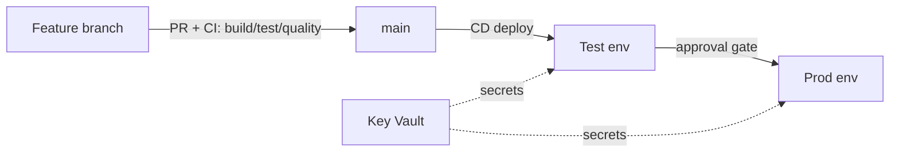

# CI/CD for Data Engineering — Interview Questions & Answers

## Overview
CI/CD automates building, testing, and deploying data pipelines (ADF, Databricks, SQL) across Dev → Test → Prod. Interviews test how you version, test, and promote data code safely — a strong seniority signal.

Difficulty: 🟢 · 🟡 · 🔴 · Confidence: ★.

---

## Interview Questions & Answers

### 🟢 Q1. What is CI/CD? CI vs CD? ★★★★★
**CI (Continuous Integration)** = on every commit, build + run tests + validate so issues surface early. **CD (Continuous Delivery/Deployment)** = automatically package and deploy validated artifacts to environments (with approvals for prod).

### 🔴 Q2. How do you do CI/CD for ADF? ★★★★★
Git-integrate ADF (collaboration + feature branches). **Publish** from `main` generates **ARM templates** into the `adf_publish` branch. A DevOps/GitHub release deploys those ARM templates to Test/Prod, overriding **per-environment ARM parameters** (linked-service endpoints, Key Vault URLs). Modern alt: the **ADFUtilities** npm package for validation/export without the publish branch.

### 🔴 Q3. How do you do CI/CD for Databricks? ★★★★☆
Code in **Repos/Git**; package/deploy with **Databricks Asset Bundles (DAB)** or `dbx`; deploy notebooks + job definitions per environment; unit-test PySpark with `pytest`/`chispa`; secrets via secret scopes; run data-quality checks before promotion.

### 🟡 Q4. How do you manage environment-specific config? ★★★★★
**Parameterize** everything environment-specific (endpoints, paths, connection strings); store values in **variable groups / Key Vault**; inject per stage at deploy time. Never hard-code env values in code.

### 🟡 Q5. Branching strategy for data teams? ★★★★☆
**GitHub Flow / trunk-based**: short-lived feature branches → PR + review + CI checks → merge to `main` → deploy. Keep `main` always deployable; use branch protection and required reviews.

### 🔴 Q6. How do you test data pipelines? ★★★★☆
**Unit** tests on transformation functions (chispa/pytest on small samples); **integration** tests on a Test workspace with sample data; **data-quality** tests (DLT expectations / Great Expectations) as gates; schema/contract tests. Fail the pipeline before prod on violations.

### 🟡 Q7. Where do secrets go in a pipeline? ★★★★★
In **Key Vault** (referenced via variable groups / linked services / secret scopes) — never in YAML, code, or config files. Pipelines authenticate with a **service principal / managed identity**.

### 🔴 Q8. Blue-green / rollback for data? ★★★☆☆
Deploy new logic to a parallel path or table version; validate; then switch. **Rollback** via **Delta time travel / RESTORE** to a prior table version and redeploy the previous artifact. Keep deployments idempotent so re-runs are safe.

### 🟡 Q9. Azure DevOps vs GitHub Actions? ★★★☆☆
Both do CI/CD. **Azure DevOps** = Repos/Pipelines/Boards/Artifacts, strong Azure integration, YAML or classic. **GitHub Actions** = workflows in the repo, huge marketplace. Choice is usually org preference; concepts are the same.

### 🟡 Q10. What is IaC's role in CI/CD? ★★★★☆
**Infrastructure as Code** (Terraform/Bicep/ARM) provisions the resources (storage, Databricks, ADF) reproducibly and version-controlled, so environments are identical and rebuildable — the foundation deployments run on.

### 🟡 Q11. What are deployment gates/approvals? ★★★☆☆
Manual or automated checks between stages (e.g., a required human **approval** before prod, or a quality gate that must pass). They prevent unreviewed changes reaching production.

### 🟡 Q12. How do you version notebooks/SQL safely? ★★★☆☆
Keep them in **Git** (Databricks Repos / Git folders), review via PRs, and deploy specific commits/tags — not the workspace's built-in revision history.

---

## Scenario Questions
**🔴 S1. "Promote ADF dev→prod without breaking prod linked services." ★★★★★** → parameterize env values in ARM template parameters; the release overrides them per stage; secrets from Key Vault.
**🔴 S2. "A bad deploy corrupted a Gold table." ★★★★☆** → **Delta RESTORE** to the prior version; redeploy the previous artifact; add a data-quality gate to catch it next time.
**🟡 S3. "Test a transformation before prod." ★★★★☆** → unit-test the PySpark logic (chispa), run on sample data in a Test workspace, run expectations, then promote.
**🟡 S4. "Consistent Dev/Test/Prod infra." ★★★★☆** → **Terraform/Bicep** modules + per-env variables in the pipeline.

---

## Diagram

---

## Quick Revision
- ✔ CI = build+test on commit; CD = auto-deploy (approvals for prod)
- ✔ ADF: **Git → publish ARM → DevOps release with per-env params**
- ✔ Databricks: **Repos + Asset Bundles/dbx + pytest**
- ✔ Secrets → **Key Vault / variable groups**, never in code
- ✔ IaC (Terraform/Bicep/ARM) provisions infra reproducibly
- ✔ Rollback via **Delta time travel** + prior artifact
- ✔ Gates/approvals + data-quality tests before prod

## Common Interview Mistakes
- Hard-coding env-specific endpoints.
- Deploying dev linked services to prod.
- No automated tests / data-quality gates.
- Secrets in pipeline YAML.

## Senior-Level Discussion
Seniors set up trunk/GitHub-flow branching, automated build+unit+data-quality gates, parameterized multi-stage releases, Key Vault-backed secrets, IaC for infra, and Delta-based rollback — treating pipelines as versioned software with tests and reviews.

## Follow-up Questions
- "How do you deploy ADF without downtime?" → deploy ARM to prod with triggers managed around the release.
- "How do you unit-test Spark?" → chispa/pytest comparing DataFrames on small fixtures.

## Related Topics
Azure DevOps, Git, Terraform, ARM Templates, Azure Data Factory, Azure Databricks
