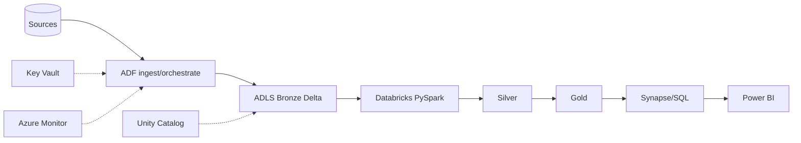

# Cheat Sheets — Azure Data Engineer (Last-Minute Revision)

## Overview
One-page rapid-fire recall across the whole stack. Skim this the hour before an interview.

---

## Spark / PySpark
- **Transformations lazy** (`select/filter/join/groupBy`) · **Actions** trigger (`count/collect/show/write`)
- **Narrow** (no shuffle) vs **Wide** (shuffle: groupBy/join/distinct/orderBy)
- Job → Stages (split at **shuffle**) → Tasks (**1 per partition**)
- `repartition` = shuffle (up/down) · `coalesce` = no shuffle (down only)
- **Broadcast** small table → kills join shuffle
- **cache** = MEMORY_AND_DISK; only for reused DataFrames
- **Skew** → salt / AQE skew join / broadcast
- **AQE** = runtime coalesce + skew + join switch
- Avoid **Python UDFs** (slow, opaque) → built-ins / Pandas UDF
- Never `collect()` big data (driver OOM)

## Delta Lake
- Delta = **Parquet + _delta_log** (JSON commits + checkpoints)
- ACID via **optimistic concurrency** + snapshot isolation
- **MERGE** = atomic upsert/CDC/SCD2
- **OPTIMIZE** (compact) · **ZORDER** (skipping, high-card) · **VACUUM** (cleanup, 7-day default, breaks old time travel)
- Time travel: `VERSION/TIMESTAMP AS OF`, `RESTORE`, `DESCRIBE HISTORY`
- Schema **enforced**; evolve with `mergeSchema`
- **Managed** DROP deletes data; **external** keeps it

## Medallion / Lakehouse
- **Bronze** (raw) → **Silver** (clean/validate/join) → **Gold** (curated/aggregate)
- Lakehouse = lake cost/openness + warehouse reliability (via Delta)
- Auto Loader (`cloudFiles`) = incremental file ingestion

## ADF
- Linked Service → Dataset → Activity → Pipeline
- IR: **Azure** (cloud) · **Self-Hosted** (on-prem/private) · **SSIS** (lift)
- Triggers: Schedule · **Tumbling Window** (stateful/backfill) · Storage Event · Manual
- **Incremental = watermark table** on source modified column
- **Metadata-driven** = one pipeline + control table (senior signal)
- CI/CD = Git → publish ARM → DevOps release with per-env params
- Copy for movement, **Databricks for transformation**

## Databricks
- **Job cluster** (auto-terminate) for prod; all-purpose for dev
- ADLS access = **Unity Catalog / SP + secret scope**, never keys
- DBU billing → job clusters + autoscale + Photon + spot
- `%run` shares vars · `dbutils.notebook.run()` separate + returns string
- Unity Catalog = `catalog.schema.table`, GRANT to groups, auto lineage

## SQL
- ROW_NUMBER (unique) · RANK (gaps) · DENSE_RANK (no gaps)
- WHERE filters rows · **HAVING** filters groups
- Nth highest = `DENSE_RANK`; dedupe = `ROW_NUMBER=1`
- Index WHERE/JOIN/ORDER BY; **SARGable** predicates (no func on column)
- UNION dedups · UNION ALL keeps dupes
- TRUNCATE (fast, no WHERE) vs DELETE (logged, WHERE)
- **SCD2** via MERGE

## Synapse
- Dedicated (MPP warehouse, pause when idle) vs Serverless (pay/TB, query lake)
- Distribution: **HASH** (big fact) · **REPLICATE** (small dim) · **ROUND_ROBIN** (staging)
- Enemy = **data movement**; align join keys
- Load via **COPY INTO / PolyBase**; clustered columnstore default

## ADLS Gen2
- Blob + **hierarchical namespace** (real folders, ACLs)
- Security = **RBAC (coarse) + ACLs (fine) + Managed Identity**; no keys
- Tiers Hot/Cool/Cold/Archive + **lifecycle** for cost
- Redundancy: LRS < ZRS < GRS < GZRS

## Streaming
- Event Hubs = high-throughput ingestion; **partitions** = parallelism (order per partition); **consumer groups** = independent readers
- Kafka: topic → partitions → offsets; consumer group scale-out
- Structured Streaming: **checkpoint** = exactly-once; `availableNow` trigger = run-then-stop
- ASA windows: **Tumbling** (non-overlap) · Hopping (overlap) · Sliding · Session

## Security (say these together)
- **Managed Identity + RBAC** (no keys/SAS)
- **Key Vault** for secrets
- **Private endpoints + firewall** (no public traffic)
- **Unity Catalog** (fine-grained + lineage) + **Purview** (catalog/PII)
- Diagnostic logs → **Log Analytics** + alerts

## Cost optimization (say these together)
- Databricks: job clusters + auto-terminate + autoscale + **spot** + Photon + pools
- ADF: kill Data Flow debug, right-size DIUs, incremental
- Synapse: **pause** dedicated pools, serverless for ad-hoc
- Storage: lifecycle tiering + file compaction (OPTIMIZE)

## Reliability patterns
- **Idempotency** = MERGE on key / partition overwrite
- **Incremental** = watermark / CDC
- **Retries + alerts** on every scheduled job
- **Delta RESTORE** for rollback
- **Data-quality gates** (DLT expectations / Great Expectations)

---

## The reference architecture (draw this)

## 60-second mental checklist before any design answer
1. Clarify **SLA / freshness / volume**
2. **Ingest** (ADF/Auto Loader/Event Hub) + incremental
3. **Store** (ADLS + medallion Delta)
4. **Transform** (Databricks/PySpark)
5. **Serve** (Synapse/SQL/Power BI)
6. **Govern** (Unity Catalog/Purview) + **Secure** (MSI/Key Vault/private endpoints)
7. **Orchestrate + CI/CD** (ADF/Workflows + DevOps)
8. **Monitor + cost** (Log Analytics/alerts; job clusters/pause)
