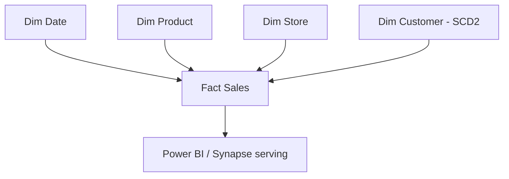

# Data Warehousing — Interview Questions

## Overview
Dimensional modeling and warehouse concepts underpin every serving layer. Interviews test star vs snowflake, facts vs dimensions, SCDs, grain, surrogate keys, and Kimball vs Inmon — plus how these map to Synapse/Databricks Gold tables.

---

## Frequently Asked Interview Questions

| # | Question | Difficulty | Confidence |
|---|---|---|---|
| 1 | Star vs snowflake schema? | 🟢 | ★★★★★ |
| 2 | Fact vs dimension table? | 🟢 | ★★★★★ |
| 3 | SCD Types 1/2/3 (and 4/6)? | 🔴 | ★★★★★ |
| 4 | What is grain? Why define it first? | 🟡 | ★★★★★ |
| 5 | Surrogate key vs natural key? | 🟡 | ★★★★★ |
| 6 | Types of fact tables? | 🟡 | ★★★☆☆ |
| 7 | Types of dimensions (conformed/junk/degenerate/role-playing)? | 🔴 | ★★★☆☆ |
| 8 | Kimball vs Inmon? | 🟡 | ★★★★☆ |
| 9 | Additive / semi-additive / non-additive measures? | 🔴 | ★★★☆☆ |
| 10 | Data warehouse vs data mart vs lakehouse? | 🟡 | ★★★★☆ |
| 11 | Normalization vs denormalization? | 🟡 | ★★★★☆ |
| 12 | Factless fact table? | 🔴 | ★★☆☆☆ |
| 13 | Slowly changing vs rapidly changing dimensions? | 🟡 | ★★☆☆☆ |
| 14 | How do you implement SCD2 in Delta/Spark? | 🔴 | ★★★★☆ |
| 15 | Late-arriving dimensions / early-arriving facts? | 🔴 | ★★☆☆☆ |
| 16 | Bridge tables (many-to-many)? | 🔴 | ★★☆☆☆ |
| 17 | Star schema vs OBT (one big table)? | 🟡 | ★★★☆☆ |
| 18 | How does modeling map to the Gold layer? | 🟡 | ★★★★☆ |

---

## Detailed Answers

### Q1. Star vs snowflake
**Star** = fact surrounded by **denormalized** dimensions (fewer joins, fast queries, some redundancy). **Snowflake** = dimensions **normalized** into sub-tables (less redundancy, more joins, slower). Warehouses/BI favor **star** for query speed and simpler DAX.

### Q3. SCD types (must-know)
- **Type 0:** never changes (retain original).
- **Type 1:** overwrite, no history.
- **Type 2:** **new row per change** + `start_date`/`end_date`/`is_current` (full history) — the common one, via MERGE.
- **Type 3:** add a "previous value" column (limited history).
- **Type 4:** history in a separate table.
- **Type 6:** hybrid (1+2+3).

### Q4. Grain
The **grain** = what one fact row represents (e.g., one order line, one daily balance). Define it **first** — every dimension and measure hangs off it. Mixed grain = broken aggregations.

### Q5. Surrogate vs natural key
**Surrogate** = system-generated integer PK for dimensions — stable, decoupled from source, and **required for SCD2** (a customer can have multiple rows/versions, each with a unique surrogate key). **Natural key** = business key from the source (may change/reuse).

### Q6. Fact table types
**Transaction** (one row per event), **Periodic snapshot** (state at intervals, e.g., daily balance), **Accumulating snapshot** (one row per process, updated through milestones).

### Q9. Measure additivity
**Additive** (sum across all dims, e.g., sales amount), **semi-additive** (sum across some, not time — e.g., account balance), **non-additive** (ratios/percentages — never sum).

### Q8. Kimball vs Inmon
**Kimball** = bottom-up, dimensional marts first, conformed dimensions (faster to value). **Inmon** = top-down, normalized enterprise warehouse first, then marts (more governance, slower).

---

## Scenario Questions

**🔴 S1. "Track history of customer address changes." ★★★★★**
**SCD Type 2** dimension: on change, close the current row (`is_current=0`, set `end_date`) and insert a new version with a new surrogate key — via Delta `MERGE`.

**🟡 S2. "Report needs fast slice-and-dice." ★★★★☆**
**Star schema** Gold tables (denormalized conformed dimensions) so BI (Power BI VertiPaq) is fast.

**🟡 S3. "Two marts disagree on 'customer'." ★★★★☆**
**Conformed dimension** — one shared, governed customer dimension across facts.

**🔴 S4. "Fact arrives before its dimension row exists." ★★☆☆☆**
**Late-arriving dimension** handling: insert a placeholder/inferred dimension member (surrogate key) now, update attributes when the dimension arrives.

**🔴 S5. "Employee can belong to many projects (M:N)." ★★☆☆☆**
**Bridge table** between the fact and the multi-valued dimension, optionally with allocation weights.

---

## Hands-on Questions
- **Design** a star schema for retail sales (fact + product/date/store/customer dims).
- **Implement** SCD2 with Delta MERGE.
- **Model** an accumulating snapshot for an order-fulfillment process.
- **Migrate** a normalized OLTP schema into a dimensional Gold model.

---

## Code Examples
```sql
-- SCD Type 2 with Delta MERGE (Databricks / Spark SQL)
MERGE INTO dim_customer t
USING staging s
  ON t.natural_key = s.natural_key AND t.is_current = true
WHEN MATCHED AND (t.city <> s.city OR t.email <> s.email) THEN
  UPDATE SET t.is_current = false, t.end_date = current_date()
WHEN NOT MATCHED THEN
  INSERT (surrogate_key, natural_key, city, email, is_current, start_date, end_date)
  VALUES (s.surrogate_key, s.natural_key, s.city, s.email, true, current_date(), null);
-- (Insert-new-version for changed keys is handled by a second insert step / apply-changes.)
```
```sql
-- Star schema fact
CREATE TABLE fact_sales (
  sale_sk BIGINT, date_sk INT, product_sk INT, store_sk INT,
  customer_sk INT, quantity INT, amount DECIMAL(18,2)   -- FKs to dims + measures
);
```

---

## Diagram


---

## Quick Revision
- ✔ Star (denormalized, fast) vs snowflake (normalized)
- ✔ Fact = measures + FKs; Dimension = descriptive context
- ✔ **SCD2** = new row + dates/flag (history) via MERGE; needs **surrogate keys**
- ✔ Define **grain** first
- ✔ Fact types: transaction / periodic snapshot / accumulating snapshot
- ✔ Measures: additive / semi-additive / non-additive
- ✔ Kimball (bottom-up marts) vs Inmon (top-down EDW)
- ✔ Gold layer = star-schema serving

## Common Mistakes
- Confusing star vs snowflake.
- Not defining grain (mixed-grain facts).
- Natural keys where surrogate keys enable SCD2.
- Summing non-additive measures (percentages).
- Mixing up SCD types.

## Senior-Level Discussion
Seniors design **conformed dimensions**, choose SCD strategy per dimension, define grain explicitly, handle late-arriving dimensions, and implement models as **Delta Gold tables** with MERGE-based SCD2 — served via Synapse/Power BI. They weigh **star vs OBT** (one-big-table) trade-offs for modern BI.

## Follow-up Questions
- "Why surrogate keys for SCD2?" → one natural key → many versioned rows, each needs a unique PK.
- "Additive vs semi-additive example?" → sales (additive) vs balance (semi-additive, can't sum over time).
- "How do you handle a huge, fast-changing dimension?" → mini-dimension / rapidly-changing dimension split.

## Related Topics
SQL, Azure Synapse, Lakehouse, Delta Lake, Data Lake, Power BI
