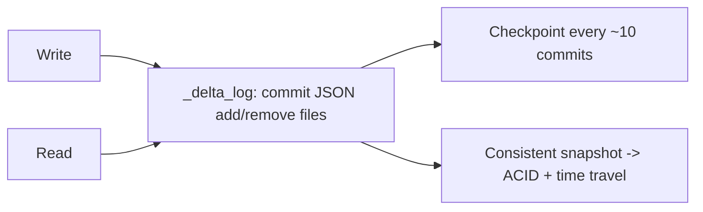

# Delta Lake — Interview Questions

## Overview
Delta Lake adds **ACID transactions, time travel, schema enforcement, and performance features** to Parquet files on a data lake — the storage foundation of the lakehouse. A 5+ yr Azure DE must know its internals (transaction log), MERGE, maintenance (OPTIMIZE/ZORDER/VACUUM), and concurrency.

---

## Frequently Asked Interview Questions

| # | Question | Difficulty | Confidence |
|---|---|---|---|
| 1 | What is Delta Lake? What problem does it solve? | 🟢 | ★★★★★ |
| 2 | What physically makes a Delta table? | 🟡 | ★★★★★ |
| 3 | How does the transaction log work? | 🔴 | ★★★★★ |
| 4 | How does Delta give ACID on a lake? | 🔴 | ★★★★☆ |
| 5 | Time travel — how & use cases? | 🟡 | ★★★★★ |
| 6 | MERGE — syntax and use cases? | 🟡 | ★★★★★ |
| 7 | OPTIMIZE vs ZORDER vs VACUUM? | 🔴 | ★★★★★ |
| 8 | Managed vs external Delta tables? | 🟡 | ★★★★☆ |
| 9 | Schema enforcement vs evolution? | 🟡 | ★★★★★ |
| 10 | How does Delta handle concurrent writes? | 🔴 | ★★★☆☆ |
| 11 | Streaming with Delta (source/sink)? | 🟡 | ★★★★☆ |
| 12 | Small-file problem — cause & fix? | 🟡 | ★★★★☆ |
| 13 | How to implement SCD Type 2 in Delta? | 🔴 | ★★★★☆ |
| 14 | GDPR delete / row-level delete? | 🟡 | ★★★☆☆ |
| 15 | Delta vs Parquet vs Iceberg/Hudi? | 🟡 | ★★★☆☆ |
| 16 | Checkpoints in the transaction log? | 🔴 | ★★☆☆☆ |
| 17 | What is a Deletion Vector? | 🔴 | ★★☆☆☆ |
| 18 | Liquid clustering vs ZORDER? | 🔴 | ★★☆☆☆ |

---

## Detailed Answers

### Q3. Transaction log (`_delta_log`) — the heart of Delta
Every write creates an ordered **JSON commit** (`000000.json`, `000001.json`...) listing files **added/removed**. Readers replay the log to know the current file set. Every ~10 commits a **Parquet checkpoint** summarizes state for fast replay. The log enables **ACID, time travel, and optimistic concurrency**. *This is the #1 internals question — know it cold.*

### Q4. ACID via optimistic concurrency
Writers read the current log version, do their work, then attempt to commit the next version. If another writer committed meanwhile, Delta checks for conflicts and either commits or retries. Readers always see a consistent **snapshot** (snapshot isolation).

### Q6. MERGE (upsert/CDC/SCD)
```sql
MERGE INTO target t USING source s ON t.id = s.id
WHEN MATCHED AND s.op='D' THEN DELETE
WHEN MATCHED THEN UPDATE SET *
WHEN NOT MATCHED THEN INSERT *;
```
One atomic op for insert/update/delete. **Performance tip:** filter/partition-prune the target on the join key so MERGE doesn't rewrite the whole table.

### Q7. OPTIMIZE vs ZORDER vs VACUUM
- **OPTIMIZE** — compacts many small files into fewer ~1GB files (fixes small-file problem, speeds reads).
- **ZORDER BY (col)** — co-locates related data so queries filtering that column skip more files (data skipping). For **high-cardinality** filter columns.
- **VACUUM** — physically deletes unreferenced files older than retention (default **7 days**). Reclaims storage but **breaks time travel** past retention.

### Q9. Schema enforcement vs evolution
Enforcement **rejects** writes whose schema doesn't match (protects quality). Evolution **opts in** to add/change columns (`mergeSchema` to add, `overwriteSchema` to change types).

### Q12. Small-file problem
Cause: frequent small writes (streaming micro-batches, per-record writes). Fix: **OPTIMIZE**, **optimized writes + auto-compaction**, tune streaming trigger, `coalesce` before batch writes. Symptom: slow reads, many tasks.

---

## Scenario Questions
**S1. "Streaming job created 2M tiny files; reads crawl."** Enable optimized writes/auto-compaction, schedule `OPTIMIZE`, tune trigger to larger micro-batches.
**S2. "Bad overwrite corrupted Gold last night."** `RESTORE TABLE gold.t TO VERSION AS OF n` (if within VACUUM retention) — that's why you don't VACUUM aggressively.
**S3. "Need SCD2 customer dimension."** `MERGE`: close current row (`is_current=0, end_date`) on change, insert new version.
**S4. "GDPR: delete a user's data across tables."** `DELETE FROM t WHERE user_id=...` then `VACUUM` to remove underlying files (respect retention/compliance).
**S5. "Two jobs writing the same table conflict."** Optimistic concurrency + retries; partition writes to disjoint partitions; use `MERGE` idempotently.

---

## Code Examples
```sql
DESCRIBE HISTORY gold.orders;
SELECT * FROM gold.orders VERSION AS OF 20;
OPTIMIZE gold.orders ZORDER BY (customer_id);
VACUUM gold.orders RETAIN 168 HOURS;
DELETE FROM gold.orders WHERE user_id = 42;
CONVERT TO DELTA parquet.`/mnt/legacy/orders`;
```

---

## Diagram


---

## Quick Revision
- ✔ Delta = Parquet + **_delta_log** (JSON commits + checkpoints)
- ✔ ACID via **optimistic concurrency** + snapshot isolation
- ✔ **MERGE** = atomic upsert/CDC/SCD2
- ✔ **OPTIMIZE** (compact) · **ZORDER** (skipping, high-card) · **VACUUM** (cleanup, 7-day default, breaks old time travel)
- ✔ Schema **enforced**; evolve with `mergeSchema`
- ✔ Time travel: `VERSION/TIMESTAMP AS OF`, `RESTORE`, `DESCRIBE HISTORY`
- ✔ Small files → OPTIMIZE / optimized writes

## Common Interview Mistakes
- Not knowing the transaction log is what enables ACID/time travel.
- Aggressive VACUUM → lost time travel / recovery ability.
- Over-partitioning instead of ZORDER.
- Thinking Delta is a database engine (it's files + log on ADLS).

## Senior-Level Discussion
Seniors discuss **MERGE partition pruning**, **optimized writes vs scheduled OPTIMIZE**, **retention vs recoverability trade-offs**, **concurrency conflict handling**, **deletion vectors / liquid clustering** (newer), and how Delta unifies **batch + streaming** on one table.

## Follow-up Questions
- "How does time travel survive VACUUM?" → only within retention; older versions' files are gone.
- "Why can a MERGE be slow?" → whole-table rewrite without join-key pruning/partitioning.
- "Delta vs Iceberg/Hudi?" → similar goals; Delta is native/optimized on Databricks; open format via Delta UniForm.

## Related Topics
[Lakehouse](../Lakehouse/) · [Azure Databricks](../Azure%20Databricks/) · [PySpark](../PySpark/) · [Data Lake](../Data%20Lake/)
