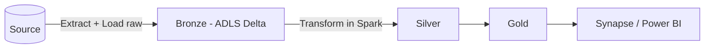

# ETL vs ELT — Interview Questions & Answers

## Overview
ETL transforms **before** loading; ELT loads raw first, transforms **in place** using the target's compute. Modern Azure lakehouse pipelines are ELT (cheap storage + Spark/SQL compute). Interviews test the difference, when to use each, tool mapping, and incremental/idempotent loading.

Difficulty: 🟢 · 🟡 · 🔴 · Confidence: ★.

---

## Interview Questions & Answers

### 🟢 Q1. ETL vs ELT — the difference? ★★★★★
**ETL** = Extract → **Transform** (in a separate engine) → Load. **ELT** = Extract → Load raw into the lake/warehouse → **Transform** there using its compute. Same steps, different order of transform vs load.

### 🟡 Q2. When to use ETL vs ELT? ★★★★★
**ETL** when the target is expensive/rigid, heavy cleansing is needed before load, or for legacy/on-prem warehouses. **ELT** when you have cheap storage + elastic compute (lakehouse) and want to keep raw data for reprocessing and scale transformations — the modern default.

### 🟡 Q3. Why has ELT become popular? ★★★★☆
Cheap object storage + powerful elastic compute (Databricks/Synapse) make "load raw, transform later" cheaper and more flexible; retaining raw enables **replay/reprocessing** when logic changes.

### 🟡 Q4. Which Azure tools map to each? ★★★★☆
ETL-style: ADF **Mapping Data Flows**, SSIS. ELT: ADF **Copy** to ADLS (raw) → **Databricks/Synapse** transforms → serving. Orchestration for both: **ADF / Databricks Workflows**.

### 🟡 Q5. ELT + medallion architecture? ★★★★☆
ELT naturally maps to **Bronze (raw) → Silver (clean/validate/join) → Gold (curated/aggregate)** Delta layers. Load raw to Bronze, then transform forward — each hop can be batch or streaming.

### 🟡 Q6. Full load vs incremental load? ★★★★★
**Full** = reload everything each run (simple but costly/slow at scale). **Incremental** = load only changed rows since last run via a **watermark** (max modified date) or **CDC** — the standard for large sources.

### 🔴 Q7. Idempotency in ETL/ELT? ★★★★☆
An idempotent load produces the same result if re-run (no duplicates). Achieve it with **MERGE on the business key**, or by **overwriting the target partition** for the run window (delete-by-window + insert). Never blind-append.

### 🟡 Q8. Batch vs streaming ingestion? ★★★★☆
**Batch** = scheduled bulk loads (hourly/daily) for most analytics. **Streaming** = continuous, low-latency ingestion (Event Hub/Kafka + Structured Streaming / Auto Loader) for real-time needs. Delta unifies both.

### 🔴 Q9. How do you handle CDC (change data capture)? ★★★★☆
Capture inserts/updates/deletes from the source: SQL **CDC / Change Tracking**, Debezium/Kafka, or ADF's native CDC. Apply changes downstream with **MERGE** (upsert + delete) into Delta, keeping history via SCD2 if needed.

### 🟡 Q10. Data validation in the pipeline? ★★★☆☆
Enforce quality between layers: schema checks, null/range/uniqueness rules, referential checks. Tools: **DLT expectations**, **Great Expectations**, or explicit Spark checks. Route bad rows to a **quarantine/reject** area rather than failing the whole load.

### 🟡 Q11. ETLT (hybrid) — is it a thing? ★★☆☆☆
Yes — light transforms before load (e.g., PII masking, format normalization) then heavier transforms after. Common when compliance requires masking before data lands.

### 🟡 Q12. How do you make loads restartable? ★★★☆☆
Checkpoint progress (streaming checkpoints / watermark table), idempotent writes, and partition-level reprocessing so a failed/retried run doesn't duplicate or corrupt data.

---

## Scenario Questions
**🔴 S1. "Design ingestion for 500 tables, cost-sensitive." ★★★★★** → ELT + **metadata-driven**: Copy raw to Bronze, transform to Silver/Gold in Databricks; **incremental watermark**; new table = a config row.
**🟡 S2. "Reprocess after a transform bug." ★★★★☆** → because raw Bronze is retained (ELT), just rerun Silver/Gold logic; overwrite affected partitions (idempotent).
**🟡 S3. "Real-time dashboard need." ★★★★☆** → streaming ingestion (Event Hub/Kafka + Structured Streaming), not batch ETL.
**🔴 S4. "Source sends updates & deletes." ★★★★☆** → CDC + **MERGE** into Delta (SCD2 for history).

---

## Code Examples
```sql
-- Idempotent incremental upsert (Delta MERGE)
MERGE INTO silver.orders t USING bronze.orders_new s
ON t.order_id = s.order_id
WHEN MATCHED THEN UPDATE SET *
WHEN NOT MATCHED THEN INSERT *;
```
```python
# Watermark-style incremental read
last = spark.sql("SELECT max(load_ts) v FROM control WHERE tbl='orders'").first().v
new = spark.read.table("source.orders").where(f"modified_ts > '{last}'")
```

---

## Diagram


---

## Quick Revision
- ✔ ETL = transform then load; ELT = load raw then transform
- ✔ Modern Azure = **ELT + medallion (Bronze/Silver/Gold)**
- ✔ ELT keeps raw → **reprocessing/replay**
- ✔ Incremental (watermark/CDC) over full loads at scale
- ✔ **Idempotent** loads = MERGE / partition overwrite
- ✔ CDC applied via MERGE; validate + quarantine bad rows

## Common Interview Mistakes
- Saying ELT has "no transformation" (it does — later, in the target).
- Full loads when incremental is expected.
- Non-idempotent appends → duplicates.
- Not retaining raw data.

## Senior-Level Discussion
Seniors default to ELT on the lakehouse, retain immutable raw, design **incremental + idempotent** loads with CDC/watermark, add data-quality gates with quarantine, and reserve ETL for pre-load cleansing/compliance or legacy targets.

## Follow-up Questions
- "How do you avoid duplicates on retry?" → MERGE on key / overwrite partition.
- "Watermark update fails after load succeeds?" → next run reprocesses overlap; MERGE keeps it idempotent.

## Related Topics
Azure Data Factory, Azure Databricks, Lakehouse, Data Lake, Delta Lake
