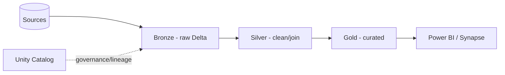

# Lakehouse — Interview Questions & Answers

## Overview
The lakehouse combines the low-cost open storage of a data lake with the reliability/performance of a warehouse — enabled by Delta Lake. It's the reference architecture for modern Azure DE (Databricks + ADLS + Delta).

Difficulty: 🟢 · 🟡 · 🔴 · Confidence: ★.

---

## Interview Questions & Answers

### 🟢 Q1. What is a lakehouse? What does it combine? ★★★★★
An architecture giving you the **low-cost, open storage of a data lake** plus the **reliability, ACID, schema, and performance of a warehouse** in one system — so BI, SQL, data science, ML, and streaming run on **one copy** of data. Enabled by **Delta Lake**.

### 🟡 Q2. Data lake vs warehouse vs lakehouse? ★★★★★
**Lake** = cheap, all data types, schema-on-read, no ACID/governance guarantees. **Warehouse** = structured, schema-on-write, ACID, fast SQL, but pricier/rigid. **Lakehouse** = lake storage + warehouse reliability (Delta), avoiding two separate systems.

### 🟢 Q3. What enables the lakehouse (Delta)? ★★★★☆
**Delta Lake** — Parquet files + a transaction log giving ACID, time travel, schema enforcement/evolution, MERGE, and performance features (OPTIMIZE/ZORDER). Without it, a lake is just files with no guarantees.

### 🟡 Q4. Medallion architecture (Bronze/Silver/Gold)? ★★★★★
**Bronze** = raw as-ingested (kept for reprocessing). **Silver** = cleaned, validated, deduplicated, joined. **Gold** = business-ready aggregates / star-schema serving. Data refines one direction; each hop can be batch or streaming.

### 🟡 Q5. Why one copy of data instead of lake+warehouse? ★★★★☆
Avoids duplicate storage + constant lake↔warehouse ETL, gives one governance model, lowers cost, and removes drift between copies. All workloads read the same governed Delta tables.

### 🔴 Q6. ACID on a lake — how? ★★★★☆
Delta's **transaction log** (`_delta_log`) records atomic commits (files added/removed); **optimistic concurrency** resolves concurrent writers; readers get a consistent **snapshot** (snapshot isolation). That yields Atomicity/Consistency/Isolation/Durability on object storage.

### 🟡 Q7. Governance in a lakehouse (Unity Catalog)? ★★★★☆
**Unity Catalog** provides a three-level namespace (`catalog.schema.table`), centralized RBAC (GRANT to groups), automatic **column/table lineage**, audit, and governed access to files via **Volumes** and external locations.

### 🟡 Q8. Lakehouse vs Snowflake vs Synapse? ★★★☆☆
**Lakehouse (Databricks)** = open Delta format, unified batch/stream/ML, cheap lake storage. **Snowflake** = warehouse with separated compute, great SQL/BI, more closed. **Synapse** = Azure-native MPP warehouse + serverless lake query. Choose by openness, ML needs, and ecosystem.

### 🟡 Q9. Batch + streaming unification? ★★★☆☆
The **same Delta table** can be a streaming sink and a batch source; Structured Streaming + Auto Loader ingest continuously to Bronze, and downstream layers stream or batch — one code path, one table.

### 🟡 Q10. Which layer for cleaned + joined data? ★★★★☆
**Silver** (cleaned/validated/deduped/joined). Bronze = raw; Gold = aggregated/business-ready. A common "identify the layer" question.

### 🟡 Q11. Why Delta over plain Parquet in a lakehouse? ★★★★☆
Parquet is just files (no transactions, no updates, no schema enforcement). **Delta** adds ACID, MERGE/updates/deletes, time travel, schema enforcement, and performance — the warehouse-grade features a lakehouse needs.

### 🔴 Q12. Open lakehouse formats — Delta vs Iceberg vs Hudi? ★★☆☆☆
All add ACID table semantics over Parquet. **Delta** is native/optimized on Databricks (with UniForm for cross-format read); **Iceberg** and **Hudi** are alternatives with similar goals; choice often follows the platform/ecosystem.

---

## Scenario Questions
**🔴 S1. "Design an end-to-end lakehouse platform." ★★★★★** → ADF ingest → ADLS Bronze (Delta) → Databricks Silver/Gold → Synapse/Power BI serving; **Unity Catalog** governance; **Key Vault** secrets; **Azure Monitor** observability.
**🟡 S2. "Report needs both fresh and historical data." ★★★★☆** → medallion Gold tables + Delta time travel for history; streaming into Silver for freshness.
**🟡 S3. "Multiple teams share governed tables." ★★★★☆** → Unity Catalog with group-based GRANTs, lineage, and audit.

---

## Diagram

---

## Quick Revision
- ✔ Lakehouse = lake cost/openness + warehouse reliability, via **Delta**
- ✔ Medallion: **Bronze (raw) → Silver (clean) → Gold (curated)**
- ✔ One copy serves BI/SQL/DS/ML/streaming
- ✔ ACID/time travel/schema from the Delta transaction log
- ✔ Governance = **Unity Catalog** (catalog.schema.table, groups, lineage)
- ✔ Delta > Parquet (ACID, MERGE, time travel)

## Common Interview Mistakes
- Calling it "just a data lake."
- Mixing up Silver vs Gold.
- Forgetting Delta is what enables it.
- Thinking it's a single product (it's an architecture).

## Senior-Level Discussion
Seniors present the lakehouse as one governed platform (medallion + Delta + Unity Catalog), justify one-copy economics, unify batch+streaming on one table, and compare with Snowflake/Synapse on openness, cost, ML, and workload fit.

## Follow-up Questions
- "How is ACID possible on object storage?" → transaction log + optimistic concurrency + snapshot isolation.
- "Where does ML fit?" → same Gold/feature tables feed MLflow — no separate copy.

## Related Topics
Delta Lake, Azure Databricks, Data Lake, Data Warehousing, ETL vs ELT
