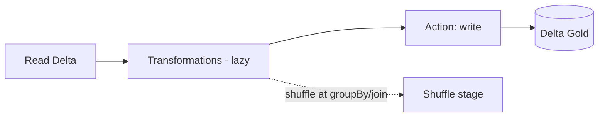

# PySpark — Interview Questions

## Overview
PySpark is the Python API for Spark — the language you write transformations in on Databricks. Interviews test DataFrame API fluency, lazy evaluation, joins/shuffles, window functions, UDFs, and the ability to reason about performance.

---

## Frequently Asked Interview Questions

| # | Question | Difficulty | Confidence |
|---|---|---|---|
| 1 | RDD vs DataFrame vs Dataset? | 🟡 | ★★★★★ |
| 2 | Transformations vs Actions (lazy evaluation)? | 🟢 | ★★★★★ |
| 3 | Narrow vs wide transformations? | 🟡 | ★★★★★ |
| 4 | What is a shuffle and why is it expensive? | 🟡 | ★★★★★ |
| 5 | `repartition()` vs `coalesce()`? | 🟡 | ★★★★★ |
| 6 | Broadcast join — what/when? | 🟡 | ★★★★★ |
| 7 | `cache()` vs `persist()`? | 🟡 | ★★★★☆ |
| 8 | Why avoid Python UDFs? Alternatives? | 🔴 | ★★★★☆ |
| 9 | How do you handle skew? | 🔴 | ★★★★☆ |
| 10 | `select` vs `withColumn`? | 🟢 | ★★★☆☆ |
| 11 | `groupBy` vs window functions? | 🟡 | ★★★★☆ |
| 12 | How do you read/write Delta/Parquet? | 🟢 | ★★★★☆ |
| 13 | Handling nulls & data quality? | 🟡 | ★★★☆☆ |
| 14 | `spark.sql.shuffle.partitions` — what/tune? | 🔴 | ★★★★☆ |
| 15 | How do you dedupe? | 🟢 | ★★★★☆ |
| 16 | Explain `explode` / nested JSON handling. | 🟡 | ★★★☆☆ |
| 17 | Pandas UDF vs regular UDF? | 🔴 | ★★★☆☆ |
| 18 | How do you debug a failing job? | 🟡 | ★★★★☆ |
| 19 | `collect()` dangers? | 🟢 | ★★★★☆ |
| 20 | How does AQE help PySpark? | 🟡 | ★★★☆☆ |

---

## Detailed Answers

### Q1. RDD vs DataFrame vs Dataset
- **RDD:** low-level, no schema, no Catalyst optimization — avoid unless you need fine control.
- **DataFrame:** table with schema; **optimized by Catalyst**; the default.
- **Dataset:** typed DataFrame (Scala/Java only; not in Python).
**Answer:** "In PySpark I use DataFrames — Catalyst + Tungsten optimize them; RDDs only for rare low-level cases."

### Q2. Transformations vs Actions
- **Transformations** (lazy): `select`, `filter`, `join`, `groupBy`, `withColumn` — build the plan.
- **Actions** (eager): `count`, `collect`, `show`, `write`, `take` — trigger execution.
**Why:** laziness lets Catalyst optimize the entire DAG before running.

### Q5. repartition vs coalesce (very common)
| | `repartition(n)` | `coalesce(n)` |
|---|---|---|
| Shuffle | **Full shuffle** | **No shuffle** (merges partitions) |
| Direction | Increase or decrease | **Decrease only** |
| Even distribution | Yes | Maybe uneven |
| Use | Increase parallelism / even out | Reduce partitions cheaply before write |
**Trap:** Use `coalesce` to reduce output files cheaply; `repartition` when you need more/even partitions (costs a shuffle).

### Q8. Why avoid Python UDFs?
Python UDFs serialize data JVM↔Python **row by row** and are **opaque to Catalyst** (no pushdown/optimization) → slow. Prefer **built-in `pyspark.sql.functions`**, **Spark SQL expressions**, or **Pandas UDFs** (vectorized, Arrow-based) when a custom function is unavoidable.

### Q9. Handling skew
- **Salting:** add a random suffix to the hot key, join on salted key, aggregate.
- **AQE skew join** (auto-splits skewed partitions).
- **Broadcast** the small side if applicable.
- Isolate the hot key and process separately.

### Q14. shuffle.partitions
Default 200 — number of partitions after a shuffle. Too high for small data = overhead/small files; too low for big data = under-parallelism/spill. Tune to roughly the number of cluster cores (or let **AQE** coalesce automatically).

---

## Scenario Questions
**S1. "Join of two huge tables is slow."** Check if one side is small → **broadcast**. Else check **skew** (salt/AQE), ensure partition pruning, tune shuffle partitions, filter before join.
**S2. "Output writes millions of tiny files."** `coalesce`/`repartition` before write, or Delta optimized writes; schedule `OPTIMIZE`.
**S3. "UDF makes the job 5× slower."** Replace with built-in functions or a Pandas UDF; UDFs block Catalyst.
**S4. "Job OOMs on the driver."** Someone did `collect()`/`toPandas()` on big data — write to Delta or aggregate first.

---

## Code Examples
```python
from pyspark.sql import functions as F
from pyspark.sql.window import Window

# Dedupe keeping latest per key
w = Window.partitionBy("id").orderBy(F.col("ts").desc())
latest = (df.withColumn("rn", F.row_number().over(w))
            .filter("rn = 1").drop("rn"))

# Nested JSON: explode array + navigate struct
flat = df.select("id", F.explode("items").alias("item")).select("id","item.sku","item.qty")

# Broadcast join
from pyspark.sql.functions import broadcast
res = fact.join(broadcast(dim), "dim_id")

# Null handling
clean = df.na.fill({"amount":0}).na.drop(subset=["id"])
```

---

## Diagram


---

## Quick Revision
- ✔ **DataFrames** (Catalyst) over RDDs
- ✔ Transformations **lazy**; actions trigger
- ✔ **repartition** = shuffle (up/down); **coalesce** = no shuffle (down only)
- ✔ **Broadcast** small table to kill join shuffle
- ✔ Avoid **Python UDFs** → built-ins / Pandas UDF
- ✔ Skew → salt / AQE / broadcast
- ✔ Never `collect()` big data
- ✔ Window functions for per-group ranking/dedupe

## Common Interview Mistakes
- Thinking transformations run immediately.
- `repartition` when `coalesce` suffices (needless shuffle).
- Writing Python UDFs for things built-ins already do.
- `collect()` → driver OOM.

## Senior-Level Discussion
Seniors reason about the **physical plan** (`df.explain()`), shuffle counts, broadcast thresholds, partition sizing (~128MB), AQE, and when to drop to Spark SQL. They treat UDFs as a last resort and always validate with the Spark UI.

## Follow-up Questions
- "Show `df.explain()` — what do you look for?" → exchanges (shuffles), broadcast vs sort-merge join, scan pruning.
- "How to make a transformation idempotent for reruns?" → overwrite partition / MERGE.

## Related Topics
[Transformations vs Actions](Transformations%20vs%20Actions.md) · [Partitioning](Partitioning.md) · [Spark Architecture](../Azure%20Databricks/Spark%20Architecture.md) · [Performance Optimization](../Azure%20Databricks/Performance%20Optimization.md)
