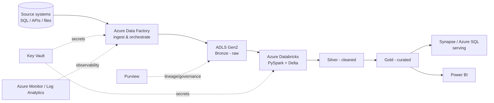

# 🎯 Azure Data Engineer — Interview Handbook

> **My personal interview prep & quick-revision handbook.** Target role: **Azure Data Engineer (5+ years)**.
> Interviewers assumed: Microsoft, Accenture, Deloitte, TCS, Cognizant, Capgemini, Infosys, Wipro, PwC, EY, and product companies.

This is **not** a learn-from-scratch course (that's the numbered folders `00_`–`09_` in the repo root). This is concise, interview-focused, production-flavored notes for **fast revision the night before an interview**.

---

## How to use this handbook

- Each topic is **independent** — open one file, revise, done.
- Every note follows the same shape: Overview → Q&A (with difficulty + confidence) → Scenarios → Hands-on → Code → Mermaid diagram → Quick Revision → Common Mistakes → Senior-Level → Follow-ups → Related Topics.
- **Difficulty:** 🟢 Easy · 🟡 Medium · 🔴 Hard
- **Confidence (how often asked):** ★★★★★ very frequent · ★★★★☆ frequent · ★★★☆☆ occasional · ☆ rare
- **Answer style:** short, "explain the WHY," production examples, Azure traps, when-NOT-to-use, bottlenecks, debugging, cost/security/monitoring angles.

---

## Revision priority (for a 5+ yr Azure DE)

**Tier 1 — asked in almost every interview (revise first):**
| Folder | Why it matters |
|---|---|
| [Azure Data Factory](Azure%20Data%20Factory/) | The orchestration backbone of most Azure DE projects |
| [Azure Databricks](Azure%20Databricks/) | Primary compute for transformation at scale |
| [PySpark](PySpark/) | The language of the transformations |
| [Delta Lake](Delta%20Lake/) | Storage format behind the lakehouse |
| [SQL](SQL/) | Every interview, every level |
| [Scenario Based Questions](Scenario%20Based%20Questions/) | Where 5+ yr candidates are separated from juniors |

**Tier 2 — very common:**
[ADLS Gen2](ADLS%20Gen2/) · [Azure Synapse](Azure%20Synapse/) · [Azure SQL](Azure%20SQL/) · [Python](Python/) · [Data Warehousing](Data%20Warehousing/) · [ETL vs ELT](ETL%20vs%20ELT/) · [Lakehouse](Lakehouse/) · [CI-CD](CI-CD/) · [Azure DevOps](Azure%20DevOps/) · [Git](Git/)

**Tier 3 — role/JD dependent:**
[Event Hub](Event%20Hub/) · [Stream Analytics](Stream%20Analytics/) · [Kafka](Kafka/) · [Azure Functions](Azure%20Functions/) · [Terraform](Terraform/) · [ARM Templates](ARM%20Templates/) · [Azure Purview](Azure%20Purview/) · [Power BI](Power%20BI/) · [Snowflake](Snowflake/) · [Docker](Docker/) · [Kubernetes](Kubernetes/) · [Data Lake](Data%20Lake/)

**Always at the end:**
[Coding Questions](Coding%20Questions/) · [HR Interview](HR%20Interview/) · [Cheat Sheets](Cheat%20Sheets/)

---

## Full contents

| # | Folder | Status |
|---|---|---|
| 1 | [Azure Data Factory](Azure%20Data%20Factory/) | ✅ Deep-dive |
| 2 | [Azure Databricks](Azure%20Databricks/) | ✅ Deep-dive |
| 3 | [PySpark](PySpark/) | ✅ Deep-dive |
| 4 | [SQL](SQL/) | ✅ Deep-dive |
| 5 | [Delta Lake](Delta%20Lake/) | ✅ Deep-dive |
| 6 | [Azure Synapse](Azure%20Synapse/) | 📝 Starter |
| 7 | [Azure SQL](Azure%20SQL/) | 📝 Starter |
| 8 | [ADLS Gen2](ADLS%20Gen2/) | 📝 Starter |
| 9 | [Azure DevOps](Azure%20DevOps/) | 📝 Starter |
| 10 | [Terraform](Terraform/) | 📝 Starter |
| 11 | [ARM Templates](ARM%20Templates/) | 📝 Starter |
| 12 | [Event Hub](Event%20Hub/) | 📝 Starter |
| 13 | [Stream Analytics](Stream%20Analytics/) | 📝 Starter |
| 14 | [Azure Functions](Azure%20Functions/) | 📝 Starter |
| 15 | [Power BI](Power%20BI/) | 📝 Starter |
| 16 | [Azure Purview](Azure%20Purview/) | 📝 Starter |
| 17 | [Python](Python/) | 📝 Starter |
| 18 | [Data Warehousing](Data%20Warehousing/) | 📝 Starter |
| 19 | [Data Lake](Data%20Lake/) | 📝 Starter |
| 20 | [ETL vs ELT](ETL%20vs%20ELT/) | 📝 Starter |
| 21 | [Lakehouse](Lakehouse/) | 📝 Starter |
| 22 | [CI-CD](CI-CD/) | 📝 Starter |
| 23 | [Git](Git/) | 📝 Starter |
| 24 | [Docker](Docker/) | 📝 Starter |
| 25 | [Kubernetes](Kubernetes/) | 📝 Starter |
| 26 | [Kafka](Kafka/) | 📝 Starter |
| 27 | [Snowflake](Snowflake/) | 📝 Starter |
| 28 | [Scenario Based Questions](Scenario%20Based%20Questions/) | ✅ Deep-dive |
| 29 | [Coding Questions](Coding%20Questions/) | 📝 Starter |
| 30 | [HR Interview](HR%20Interview/) | 📝 Starter |
| 31 | [Cheat Sheets](Cheat%20Sheets/) | ✅ Deep-dive |

**Legend:** ✅ Deep-dive = full template with 25–50+ Q&A, scenarios, code, diagrams. 📝 Starter = overview + top questions + quick revision (deepen on demand).

---

## The reference architecture these notes assume

Know this end-to-end flow cold — most "design a pipeline" scenario questions are variations of it.
