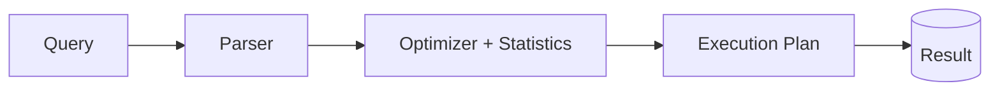

# SQL — Interview Questions

## Overview
SQL is tested in every data engineering interview at every level. For a 5+ yr Azure DE, expect query-writing (joins, windows, aggregation), optimization (indexes, execution plans), and platform-specific SQL (T-SQL, Spark SQL, Synapse).

---

## Frequently Asked Interview Questions

| # | Question | Difficulty | Confidence |
|---|---|---|---|
| 1 | Types of joins? INNER vs LEFT vs FULL? | 🟢 | ★★★★★ |
| 2 | WHERE vs HAVING? | 🟢 | ★★★★★ |
| 3 | GROUP BY vs window functions? | 🟡 | ★★★★★ |
| 4 | RANK vs DENSE_RANK vs ROW_NUMBER? | 🟡 | ★★★★★ |
| 5 | Find the Nth highest salary. | 🟡 | ★★★★★ |
| 6 | Remove duplicates from a table. | 🟡 | ★★★★★ |
| 7 | CTE vs subquery vs temp table? | 🟡 | ★★★★☆ |
| 8 | What is an index? Clustered vs non-clustered? | 🔴 | ★★★★★ |
| 9 | How do you read an execution plan? | 🔴 | ★★★★☆ |
| 10 | What causes a slow query? How to optimize? | 🔴 | ★★★★★ |
| 11 | DELETE vs TRUNCATE vs DROP? | 🟢 | ★★★★☆ |
| 12 | UNION vs UNION ALL? | 🟢 | ★★★★☆ |
| 13 | Self join — when? | 🟡 | ★★★☆☆ |
| 14 | Correlated vs non-correlated subquery? | 🟡 | ★★★☆☆ |
| 15 | ACID properties? | 🟡 | ★★★★☆ |
| 16 | Normalization vs denormalization? | 🟡 | ★★★★☆ |
| 17 | SCD types (1/2/3)? | 🔴 | ★★★★☆ |
| 18 | Running total / cumulative sum? | 🟡 | ★★★★☆ |
| 19 | Find records in A not in B (3 ways). | 🟡 | ★★★★☆ |
| 20 | Stored procedure vs function? | 🟡 | ★★★☆☆ |
| 21 | COALESCE vs ISNULL vs NULLIF? | 🟢 | ★★★☆☆ |
| 22 | PIVOT / UNPIVOT? | 🟡 | ★★★☆☆ |
| 23 | Second highest without TOP/LIMIT? | 🟡 | ★★★☆☆ |
| 24 | Transaction isolation levels? | 🔴 | ★★★☆☆ |

---

## Detailed Answers (the classics)

### Q4. RANK vs DENSE_RANK vs ROW_NUMBER
- `ROW_NUMBER` — unique sequential number, no ties (1,2,3,4).
- `RANK` — ties share a rank, **gaps** after (1,1,3,4).
- `DENSE_RANK` — ties share a rank, **no gaps** (1,1,2,3).
**Memory trick:** DENSE = no gaps (dense/packed). RANK = gaps. ROW_NUMBER = always unique.

### Q5. Nth highest salary
```sql
SELECT DISTINCT salary FROM (
  SELECT salary, DENSE_RANK() OVER (ORDER BY salary DESC) AS rnk
  FROM employees
) t WHERE rnk = 3;   -- 3rd highest
```

### Q6. Remove duplicates
```sql
WITH cte AS (
  SELECT *, ROW_NUMBER() OVER (PARTITION BY email ORDER BY id) AS rn
  FROM users
)
DELETE FROM cte WHERE rn > 1;   -- keep first per key
```

### Q8. Index / clustered vs non-clustered
- **Index** = structure that speeds lookups (avoids full table scan), at the cost of slower writes + storage.
- **Clustered** = table rows physically sorted by the key (one per table; the table *is* the index). 
- **Non-clustered** = separate structure with pointers (many per table).
**Trap:** Over-indexing slows INSERT/UPDATE. Index columns used in WHERE/JOIN/ORDER BY.

### Q10. Slow query → optimize
- Check the **execution plan** for scans, key lookups, spills, bad estimates.
- Add/adjust **indexes** on filter/join columns; avoid `SELECT *`.
- **SARGable** predicates (no functions on indexed columns: `WHERE col = x`, not `WHERE FUNC(col)=x`).
- Filter early; avoid unnecessary `DISTINCT`/`ORDER BY`.
- Update **statistics**; watch parameter sniffing.
- Reduce data scanned (partitioning in Synapse/Spark).

### Q17. SCD types
- **Type 1:** overwrite (no history).
- **Type 2:** new row per change + effective dates/flag (full history) — the common one; implement with `MERGE`.
- **Type 3:** add a "previous value" column (limited history).

---

## Scenario Questions
**S1. "Report query scans 500M rows, takes minutes."** Execution plan → add covering index / partition by date, make predicates SARGable, pre-aggregate into a Gold table.
**S2. "Duplicate rows appearing after a load."** Dedup with `ROW_NUMBER`; make the load **idempotent** (MERGE on key).
**S3. "Need full change history of a dimension."** SCD Type 2 via `MERGE`.
**S4. "Deadlocks under concurrency."** Inspect isolation level, keep transactions short, consistent access order, appropriate indexing, consider snapshot isolation.

---

## Code Examples
```sql
-- Running total (window)
SELECT id, amount,
       SUM(amount) OVER (PARTITION BY customer_id ORDER BY order_date) AS running_total
FROM orders;

-- Records in A not in B
SELECT a.* FROM a LEFT JOIN b ON a.id=b.id WHERE b.id IS NULL;  -- anti-join
-- or: SELECT id FROM a EXCEPT SELECT id FROM b;

-- SCD Type 2 (T-SQL / Spark SQL MERGE)
MERGE INTO dim_customer t
USING staging s ON t.cust_id = s.cust_id AND t.is_current = 1
WHEN MATCHED AND (t.city <> s.city) THEN UPDATE SET t.is_current=0, t.end_date=current_date()
WHEN NOT MATCHED THEN INSERT (cust_id, city, is_current, start_date) VALUES (s.cust_id, s.city, 1, current_date());
```

---

## Diagram


---

## Quick Revision
- ✔ ROW_NUMBER (unique) · RANK (gaps) · DENSE_RANK (no gaps)
- ✔ WHERE filters rows; **HAVING** filters groups
- ✔ Nth highest = `DENSE_RANK`; dedupe = `ROW_NUMBER` + delete
- ✔ Index on WHERE/JOIN/ORDER BY; clustered = physical order (1/table)
- ✔ **SARGable** predicates; read the **execution plan**
- ✔ UNION dedups; UNION ALL keeps dupes
- ✔ TRUNCATE = fast, no WHERE, resets identity; DELETE = logged, WHERE-able
- ✔ SCD2 via `MERGE`

## Common Interview Mistakes
- Confusing WHERE vs HAVING.
- Non-SARGable predicates (`WHERE YEAR(date)=2026`).
- `SELECT *` in production.
- Thinking more indexes always = faster (writes suffer).
- Mixing RANK vs DENSE_RANK.

## Senior-Level Discussion
Seniors read execution plans fluently, design indexing/partitioning for the access pattern, discuss statistics/parameter-sniffing, choose set-based over row-by-row (cursors), and translate the same logic across **T-SQL, Spark SQL, and Synapse** (distribution keys, replicated vs round-robin).

## Follow-up Questions
- "Why is your query still scanning after adding an index?" → non-SARGable predicate / low selectivity / stale stats.
- "How would this differ in Synapse dedicated pool?" → distribution + partition strategy, avoid data movement.

## Related Topics
[Window Functions](Window%20Functions.md) · [Query Optimization](Query%20Optimization.md) · [Azure SQL](../Azure%20SQL/) · [Azure Synapse](../Azure%20Synapse/)
